# AI Prompts & Interaction Design

## Overview

hide-my-list uses Claude API for all AI-powered features: intent detection, task intake, label inference, task selection, and rejection handling. This document details the prompt architecture and strategies.

## Prompt Architecture

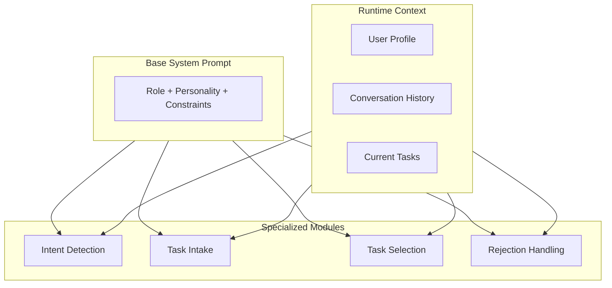

## Base System Prompt

```
You are hide-my-list, a friendly task management assistant with a unique philosophy:
users should never need to look at their task list. You handle everything.

PERSONALITY:
- Casual and brief - like texting a helpful friend
- Confident in suggestions - trust your algorithm
- Collaborative on rejections - never defensive
- Celebratory on completions - but not over the top

CONSTRAINTS:
- Never show the user their full task list
- Ask at most ONE question at a time
- Keep responses under 50 words unless explaining something complex
- Always be ready to add a task or suggest one

RESPONSE STYLE:
- No emojis unless user uses them first
- No formal greetings ("Hello!", "Thank you for...")
- Use contractions naturally
- Acknowledge briefly, then move forward
```

## Module 1: Intent Detection

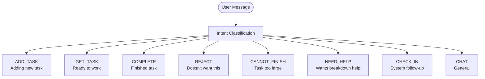

### Intent Detection Prompt

```
Classify the user's intent from their message. Return ONLY the intent category.

Categories:
- ADD_TASK: User wants to add a new task (mentions something they need to do)
- GET_TASK: User wants something to work on (mentions time available, asks what to do)
- COMPLETE: User finished their current task (says done, finished, completed)
- REJECT: User doesn't want the suggested task (says no, not that one, something else)
- CANNOT_FINISH: User indicates current task is too large or overwhelming (too big, can't finish, overwhelming)
- NEED_HELP: User wants help breaking down or starting their current task (how do I start, what's next, I'm stuck, break this down)
- CHECK_IN: System-initiated follow-up (triggered by timer, not user message)
- CHAT: General conversation or questions

Message: "{user_message}"

Intent:
```

**Note:** CHECK_IN is not detected from user messages. It is triggered automatically by the client when a task check-in timer expires. The server recognizes CHECK_IN requests by a special flag in the request payload.

### Intent Detection Examples

| Message | Intent |
|---------|--------|
| "I need to call the dentist" | ADD_TASK |
| "Remind me to buy groceries" | ADD_TASK |
| "What should I do?" | GET_TASK |
| "I have 30 minutes" | GET_TASK |
| "Done!" | COMPLETE |
| "Finished that one" | COMPLETE |
| "Not that one" | REJECT |
| "Something else" | REJECT |
| "This is too big" | CANNOT_FINISH |
| "I can't finish this in one go" | CANNOT_FINISH |
| "This is overwhelming" | CANNOT_FINISH |
| "How do I start?" | NEED_HELP |
| "What's the first step?" | NEED_HELP |
| "I'm stuck" | NEED_HELP |
| "Break this down for me" | NEED_HELP |
| "What should I do first?" | NEED_HELP |
| "How does this work?" | CHAT |
| "Hello" | CHAT |

---

## Module 2: Task Intake

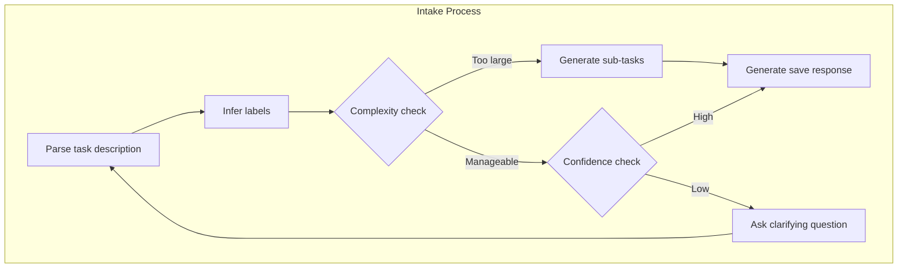

### Task Intake Prompt

```
The user wants to add a task. Extract details, infer labels, and ALWAYS generate sub-tasks.

User said: "{user_message}"
Previous context: {conversation_history}
User preferences: {user_preferences_context}

CORE PRINCIPLE: Users interpret vague goals as infinite and avoid them.
Every task MUST have explicit sub-tasks that define exactly what "done" looks like.

Analyze the task and provide structured output:

TASK_ANALYSIS:
- title: (concise task name, max 100 chars)
- work_type: (focus|creative|social|independent)
- work_type_confidence: (0.0-1.0)
- urgency: (0-100)
- urgency_confidence: (0.0-1.0)
- time_estimate_minutes: (number)
- time_confidence: (0.0-1.0)
- energy_required: (high|medium|low)

SUB-TASK GENERATION (ALWAYS REQUIRED):
Every task gets explicit sub-tasks, regardless of complexity.
- Quick tasks (15-30 min): 2-3 inline steps shown with the task
- Standard tasks (30-60 min): 3-5 inline steps
- Large tasks (60+ min): Create as hidden Notion sub-tasks

For EVERY task, generate:
- Specific, actionable steps
- Clear "done" criteria for each step
- Time estimate for each step
- Logical sequence

PERSONALIZED PREP STEPS:
Use the user's preferences to create an environment for success.
The first 1-2 steps should help the user prepare mentally and physically.

Based on user preferences, include relevant prep steps:
- If user has a preferred beverage for this work type, suggest making it
- If user has a comfort spot preference, suggest settling there
- If user has prep rituals (phone away, close tabs), include them
- Match environment suggestions to the work type

Example for social task (phone call) with tea preference:
1. Make a cup of tea
2. Find a comfortable, quiet spot
3. Make the call
4. Note any follow-ups

Example for focus task with coffee preference:
1. Make coffee and put phone in another room
2. Close email and messaging tabs
3. [Core task steps...]
4. Review work before marking done

STORAGE DECISION (use_hidden_subtasks):
- true: Store as separate Notion tasks (for tasks > 60 min or multi-phase work)
- false: Store as inline steps in task description (for tasks ≤ 60 min)

BREAKDOWN SIGNALS (use_hidden_subtasks=true):
- Vague scope: "complete the project", "finish the report", "work on X"
- Multi-phase: tasks requiring research → draft → review → finalize
- Long duration: estimated > 60 minutes
- Multiple deliverables: "prepare and send", "design and implement"

DECISION:
If any confidence < 0.5, set needs_clarification=true and provide ONE question.
If all confidences >= 0.5, set needs_clarification=false.

OUTPUT (JSON):
{
  "title": "...",
  "work_type": "...",
  "work_type_confidence": 0.0,
  "urgency": 0,
  "urgency_confidence": 0.0,
  "time_estimate_minutes": 0,
  "time_confidence": 0.0,
  "energy_required": "...",
  "needs_clarification": true|false,
  "clarification_question": "..." or null,
  "use_hidden_subtasks": true|false,
  "sub_tasks": [
    {
      "title": "...",
      "time_estimate_minutes": 0,
      "done_criteria": "what 'done' looks like",
      "sequence": 1
    }
  ],
  "inline_steps": "1. First step\n2. Second step\n3. Third step" (if use_hidden_subtasks=false),
  "presentable_title": "..." (first actionable step if use_hidden_subtasks=true),
  "confirmation_message": "..." (brief confirmation including steps summary)
}

CONFIRMATION MESSAGE FORMAT:
- For inline steps: "Added - [work type], ~[time]. Here's your plan: 1) X, 2) Y, 3) Z"
- For hidden sub-tasks: "Added - [work type], ~[time]. First step: [step]. This is 1 of [N] steps."

IMPORTANT: The user should always see specific next actions, never just "Added - focus work, ~30 min".
Every task confirmation includes the concrete steps they'll take.
```

### Storage Decision Rules

All tasks get sub-tasks. The decision is only about HOW to store them:

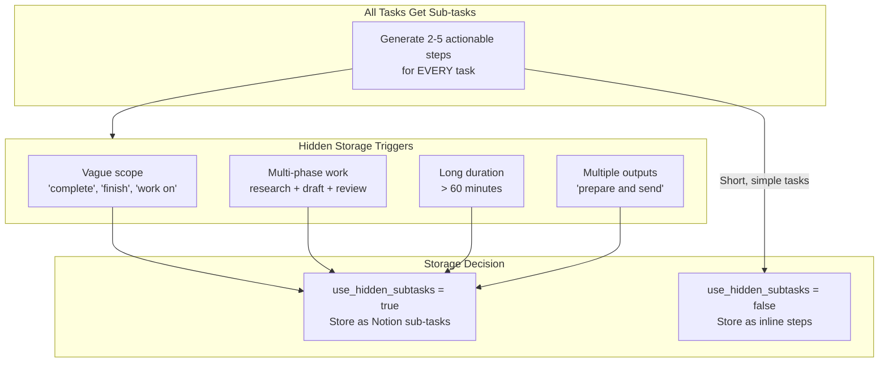

### Task Examples (All Tasks Get Sub-tasks)

**Quick Tasks (Inline Steps) - Personalized:**

| User Says | User Preferences | Confirmation Message |
|-----------|------------------|---------------------|
| "Call mom" | tea, cozy chair | "Added - social, ~15 min. Plan: 1) Make a cup of tea, 2) Settle into the cozy chair, 3) Make call, 4) Note any follow-ups" |
| "Call mom" | (none set) | "Added - social, ~15 min. Plan: 1) Find quiet spot, 2) Make call, 3) Note any follow-ups" |
| "Pay electricity bill" | batches admin tasks | "Added - independent, ~10 min. Steps: 1) Open banking app, 2) Find payee, 3) Enter amount and pay" |
| "Reply to Jake's email" | tea before social | "Added - social, ~10 min. Steps: 1) Make tea, 2) Read his email, 3) Draft and send response" |

**Standard Tasks (Inline Steps) - Personalized:**

| User Says | User Preferences | Confirmation Message |
|-----------|------------------|---------------------|
| "Review the proposal" | coffee, phone away | "Added - focus, ~45 min. Plan: 1) Make coffee, put phone away, 2) Read intro, 3) Check numbers, 4) Note concerns, 5) Draft feedback" |
| "Prepare for meeting" | natural light spot | "Added - focus, ~30 min. Steps: 1) Find your sunny spot, 2) Review agenda, 3) Gather materials, 4) Note talking points" |

**Large Tasks (Hidden Sub-tasks):**

| User Says | Presentable Title | Hidden Sub-tasks |
|-----------|-------------------|------------------|
| "Complete the project" | "Draft project outline - 30 min (1 of 4 steps)" | 1. Draft outline, 2. First revision, 3. Review, 4. Finalize |
| "Finish the report" | "Write report introduction - 20 min (1 of 4 steps)" | 1. Introduction, 2. Body sections, 3. Conclusion, 4. Edit |
| "Plan the event" | "List event requirements - 20 min (1 of 5 steps)" | 1. Requirements, 2. Venue research, 3. Budget, 4. Timeline, 5. Send invites |

### Work Type Inference Rules

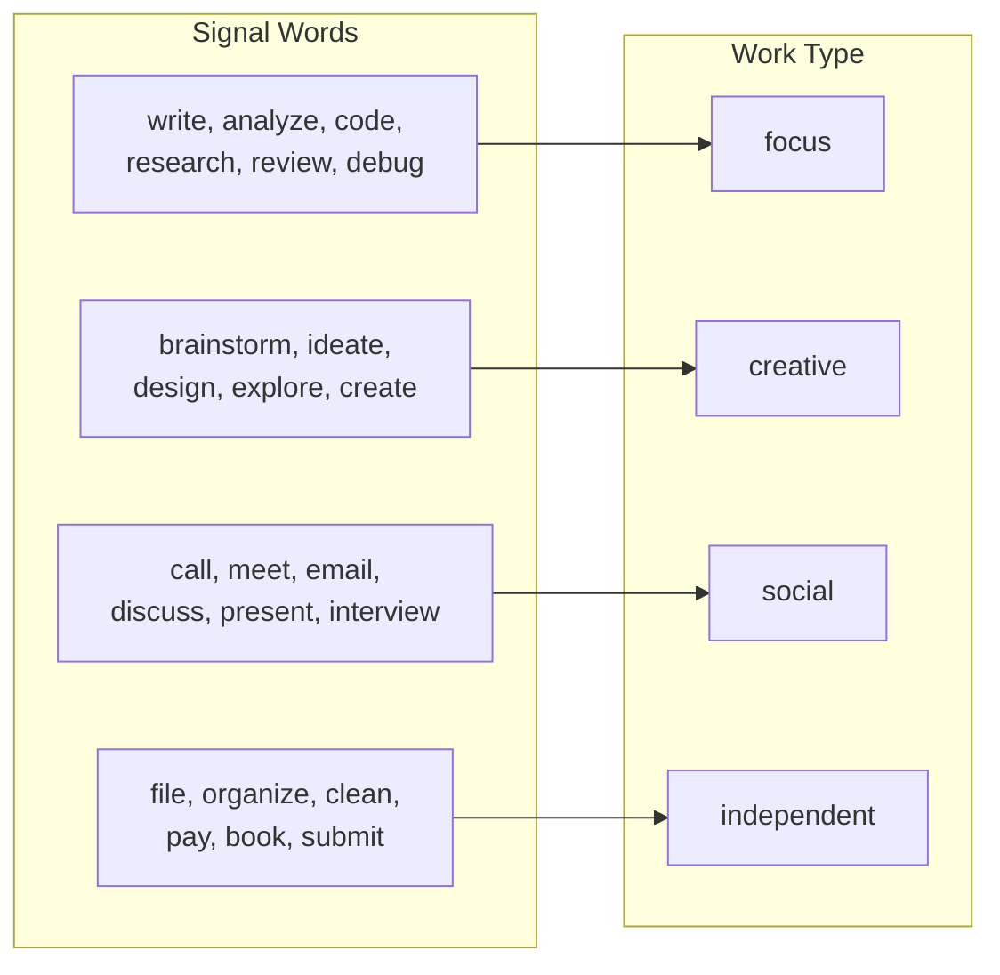

### Urgency Inference Rules

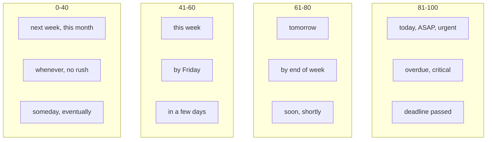

### Clarifying Questions

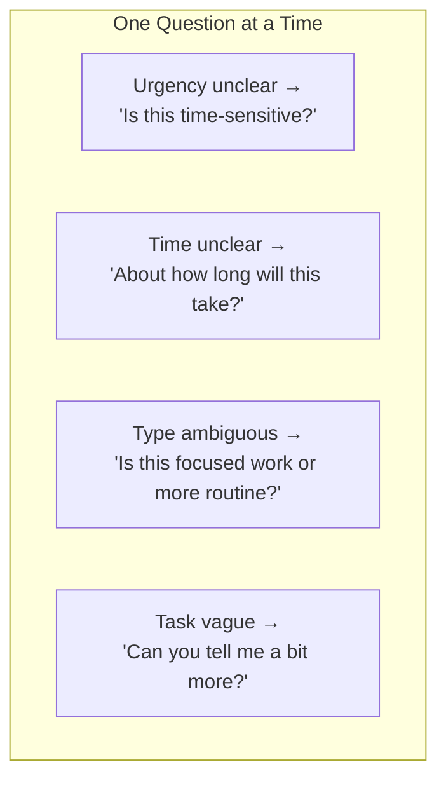

**Question Templates:**

| Missing Info | Question |
|--------------|----------|
| Urgency | "Is this time-sensitive, or can it wait?" |
| Time | "About how long do you think this will take?" |
| Work type | "Is this focused thinking or more routine work?" |
| Task unclear | "Can you tell me a bit more about what that involves?" |

---

## User Preferences Context

When generating task breakdowns, user preferences are assembled into a context block that is injected into the prompt. This enables personalized prep steps that create an environment for success.

### Preference Context Block Format

```
USER_PREFERENCES_CONTEXT:
This user has the following preferences:

General:
- Preferred beverage: {preferred_beverage}
- Comfort spot: {comfort_spot}
- Transition ritual: {transition_ritual}

For {work_type} tasks:
- Environment: {work_type_prefs.environment}
- Prep steps: {work_type_prefs.prep_steps}
- Beverage: {work_type_prefs.beverage}

Task pattern preferences (if applicable):
- {matched_pattern}: {pattern_prefs}

Current context:
- Time of day: {time_of_day} ({time_prefs})
- Energy level: {energy_level} ({energy_prefs})

When generating sub-tasks, include personalized prep steps that align with these preferences.
The first 1-2 steps should focus on environment setup and mental preparation.
```

### Example Context Blocks

**For a social task (phone call) in the afternoon:**
```
USER_PREFERENCES_CONTEXT:
This user has the following preferences:

General:
- Preferred beverage: tea
- Comfort spot: cozy chair in the living room
- Transition ritual: 3 deep breaths

For social tasks:
- Environment: comfortable, quiet spot
- Prep steps: review context, set intention
- Beverage: tea

Task pattern preferences:
- phone_calls: find quiet room, review last interaction, prepare 2-3 topics

Current context:
- Time of day: afternoon (tea preferred, good for social tasks)
- Energy level: medium (standard rituals)

When generating sub-tasks, include personalized prep steps that align with these preferences.
The first 1-2 steps should focus on environment setup and mental preparation.
```

**For a focus task (writing) in the morning:**
```
USER_PREFERENCES_CONTEXT:
This user has the following preferences:

General:
- Preferred beverage: coffee
- Comfort spot: standing desk in the office
- Transition ritual: quick stretch

For focus tasks:
- Environment: quiet office, door closed
- Prep steps: put phone in another room, close email
- Beverage: coffee
- Music: lo-fi

Task pattern preferences:
- writing: 2 min free-write warmup, breaks every 25 min

Current context:
- Time of day: morning (coffee preferred, ideal for focus work)
- Energy level: high (minimal prep, dive in quickly)

When generating sub-tasks, include personalized prep steps that align with these preferences.
The first 1-2 steps should focus on environment setup and mental preparation.
```

### Preference Fallbacks

When user preferences are not set, the system uses sensible defaults:

| Work Type | Default Prep Steps |
|-----------|-------------------|
| focus | Find quiet spot, minimize distractions |
| creative | Find inspiring space, gather materials |
| social | Find quiet spot, review context |
| independent | Gather needed items, set up workspace |

---

## Module 3: Task Selection

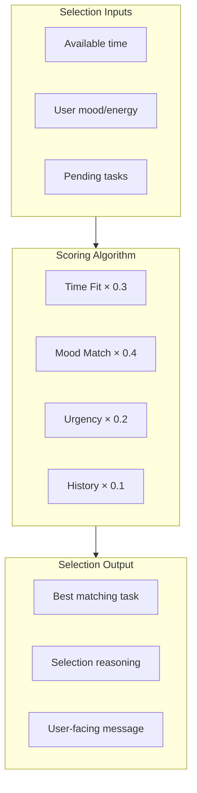

### Task Selection Prompt

```
Select the best task for the user based on their current context.

USER CONTEXT:
- Available time: {available_minutes} minutes
- Current mood: {mood} (maps to: {preferred_work_type})
- Time of day: {time_of_day}

PENDING TASKS:
{tasks_json}

SCORING RULES:
1. Time Fit (30% weight):
   - Task fits with buffer: 1.0
   - Tight fit (within 10%): 0.5
   - Doesn't fit: 0.0 (EXCLUDE)

2. Mood Match (40% weight):
   - Perfect match: 1.0
   - Related type: 0.5
   - Opposite type: 0.0

3. Urgency (20% weight):
   - Score = urgency / 100

4. History (10% weight):
   - No rejections: 0.1
   - 1-2 rejections: 0.05
   - 3+ rejections: 0.0

MOOD MAPPING:
- "focused/sharp" → prefer focus work
- "creative/inspired" → prefer creative work
- "social/energetic" → prefer social work
- "tired/low energy" → prefer independent work

OUTPUT (JSON):
{
  "selected_task_id": "...",
  "score": 0.0,
  "reasoning": "brief explanation",
  "user_message": "conversational suggestion"
}

If no tasks fit, explain why and suggest alternatives.
```

### Mood to Work Type Affinity

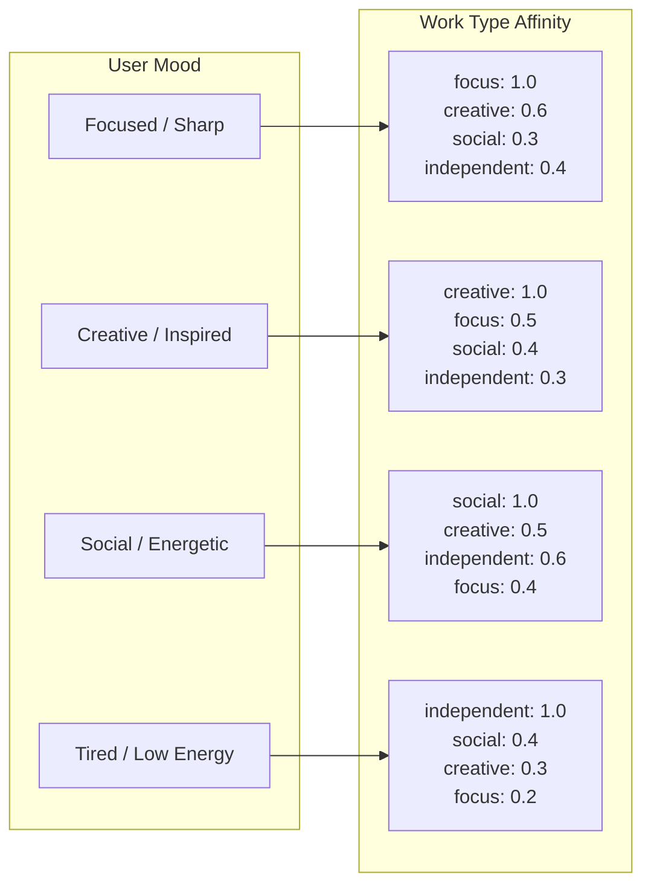

### Selection Message Templates

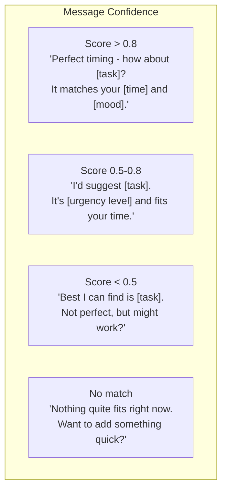

---

## Module 4: Rejection Handling


### Rejection Handling Prompt

```
The user rejected the suggested task. Understand why and find an alternative.

REJECTED TASK: {task_title}
USER'S REASON: "{rejection_reason}"
REMAINING TASKS: {remaining_tasks_json}
USER CONTEXT: {time} minutes, {mood} mood

REJECTION CATEGORIES:
1. timing - "takes too long", "not enough time"
2. mood_mismatch - "not in the mood", "too tired for that"
3. blocked - "waiting on something", "can't do it yet"
4. already_done - "already did that", "finished already"
5. general - "just not feeling it", vague rejection

ACTIONS BY CATEGORY:
- timing: Suggest shorter task, note time preference
- mood_mismatch: Suggest different work type, avoid this type now
- blocked: Mark as blocked, don't suggest until unblocked
- already_done: Mark as completed, celebrate!
- general: Log rejection, try very different task

OUTPUT (JSON):
{
  "rejection_category": "...",
  "task_update": {
    "rejection_count_increment": 1,
    "rejection_note": "[timestamp] {reason}"
  },
  "alternative_task_id": "..." or null,
  "user_message": "conversational response with alternative"
}
```

### Rejection Response Templates

| Category | Response Template |
|----------|-------------------|
| timing | "Got it - that one's too long right now. How about [shorter task]?" |
| mood_mismatch | "Fair enough. Let me find something more [appropriate mood]. How about [task]?" |
| blocked | "I'll hold off on that one. In the meantime, try [task]?" |
| already_done | "Oh nice, already done! Let me mark that off. Ready for another?" |
| general | "No problem. Here's something different: [very different task]?" |

### Escalation After Multiple Rejections

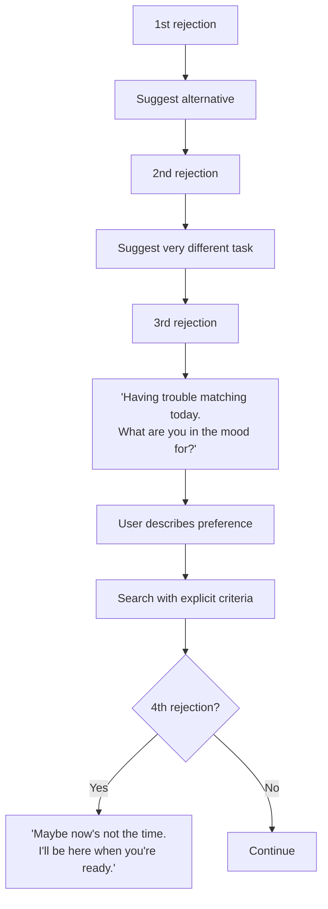

---

## Module 5: Cannot Finish Handling

When a user indicates they cannot finish a task, we need to understand what was accomplished and break down what remains.

```mermaid
flowchart TD
    CannotFinish([User: "This is too big"]) --> AskProgress[Ask what was accomplished]
    AskProgress --> UserProgress[User describes progress]
    UserProgress --> Analyze[Analyze remaining work]
    Analyze --> CreateSubtasks[Create sub-tasks for remainder]
    CreateSubtasks --> UpdateParent[Update parent task]
    UpdateParent --> OfferNext[Offer next sub-task]
```

### Cannot Finish Prompt

```
The user indicates they cannot finish the current task. Gather progress and break down remaining work.

CURRENT TASK: {task_title}
ORIGINAL TIME ESTIMATE: {time_estimate} minutes
USER MESSAGE: "{user_message}"

STEP 1: Ask what was accomplished
Generate a brief, friendly question to understand their progress.

STEP 2: Once progress is described, analyze remaining work
- What did the user complete?
- What specific work remains?
- How can remaining work be broken into 15-90 minute chunks?

STEP 3: Create sub-tasks for remaining work
- Each sub-task must be specific and actionable
- First sub-task should be the immediate next step
- Sub-tasks are HIDDEN from user

OUTPUT (JSON):
{
  "phase": "ask_progress" | "analyze_remaining",
  "user_message": "...",
  "progress_question": "..." (if phase=ask_progress),
  "completed_portion": "..." (if phase=analyze_remaining),
  "remaining_sub_tasks": [
    {
      "title": "...",
      "time_estimate_minutes": 0,
      "sequence": 1
    }
  ] (if phase=analyze_remaining),
  "next_sub_task_message": "..." (offer first remaining sub-task)
}
```

### Progress Question Templates

| Scenario | Question |
|----------|----------|
| Just started | "No worries - what did you get into before stopping?" |
| Partially done | "Got it. What part did you manage to get done?" |
| Stuck | "That's okay. What's the last thing you completed on this?" |
| Overwhelmed | "Totally understand. Tell me what you accomplished so far." |

### Remaining Work Analysis

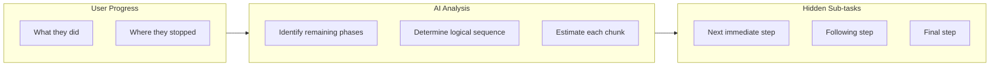

### Cannot Finish Response Flow

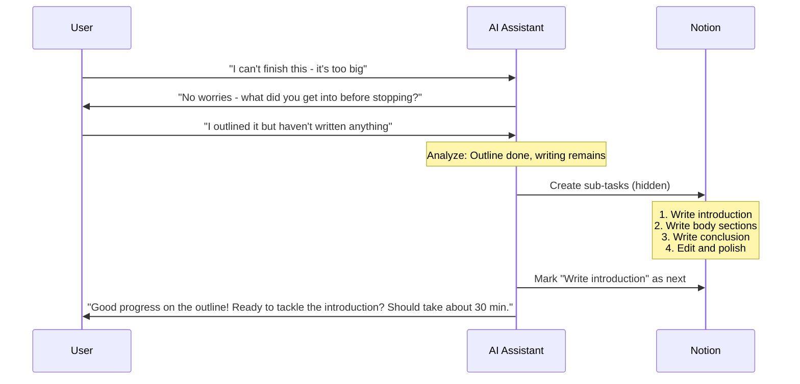

### Sub-task Creation Rules

| Original Task Type | Typical Breakdown Pattern |
|-------------------|---------------------------|
| Writing task | Outline → Sections → Edit → Finalize |
| Research task | Define scope → Gather sources → Analyze → Summarize |
| Planning task | Requirements → Options → Decision → Documentation |
| Coding task | Design → Implement → Test → Refactor |
| Creative task | Brainstorm → Draft → Iterate → Polish |

**Key Principle:** When a CANNOT_FINISH occurs, it indicates the original breakdown (if any) left tasks too large. The new breakdown should create smaller, more achievable chunks.

---

## Module 6: Check-In Handling

The check-in module handles proactive follow-ups when a user may have forgotten about their active task. This is triggered by a client-side timer set to 1.25x the task's time estimate.

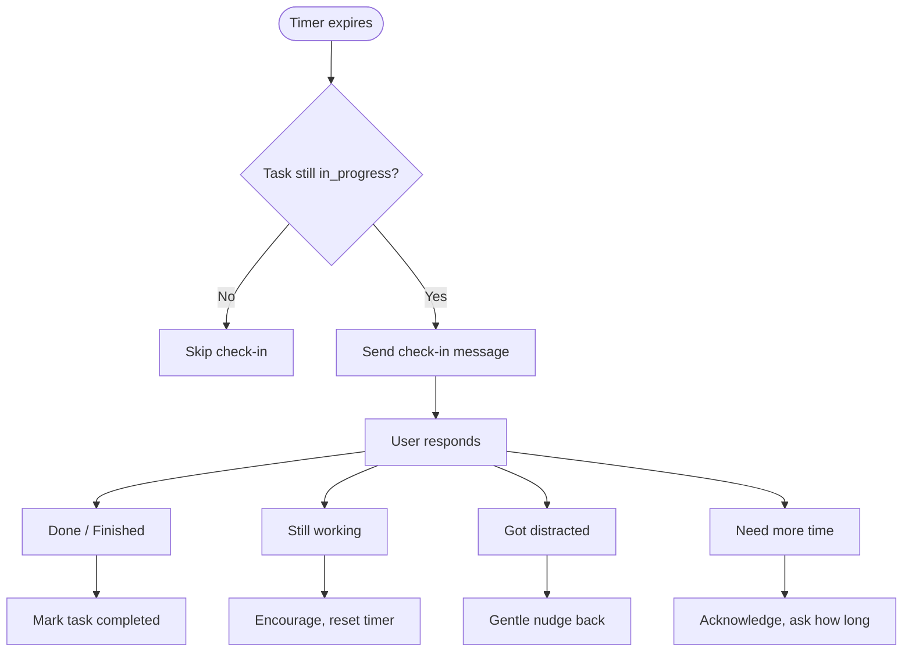

### Check-In Prompt

```
The user accepted a task but the expected completion time has passed.
Check in on their progress.

ACTIVE TASK: {task_title}
TIME ESTIMATE: {time_estimate} minutes
TIME ELAPSED: {elapsed_minutes} minutes
TASK CONTEXT: {ai_context}

Generate a brief, friendly check-in message. Keep it casual and non-judgmental.
The user may have:
- Completed the task and forgot to say so
- Still be working on it
- Gotten distracted
- Needed more time than estimated

OUTPUT (JSON):
{
  "check_in_message": "..." (brief, friendly follow-up question)
}
```

### Check-In Response Prompt

```
The user responded to a check-in about their active task.

TASK: {task_title}
USER RESPONSE: "{user_response}"

Classify the response and determine next action.

RESPONSE CATEGORIES:
- done: User completed the task
- still_working: User is still actively working
- distracted: User got sidetracked
- need_more_time: User needs additional time
- abandoned: User wants to stop working on this task

OUTPUT (JSON):
{
  "response_category": "...",
  "task_update": {
    "status": "in_progress" | "completed" | "pending",
    "note": "..." (optional note to append)
  },
  "reset_timer": true | false,
  "new_timer_minutes": null | number,
  "user_message": "..." (response to user)
}
```

### Check-In Message Templates

| Scenario | Example Message |
|----------|-----------------|
| First check-in | "How's the quarterly report going? Still at it?" |
| User says done | "Nice! Marking that off. Ready for another?" |
| User still working | "No rush - keep at it! I'll check back in a bit." |
| User got distracted | "Happens to everyone. Want to jump back in, or try something else?" |
| User needs more time | "No problem. About how much longer do you think?" |
| User abandons | "Got it - I'll put that back in the queue. What next?" |

### Check-In Timing

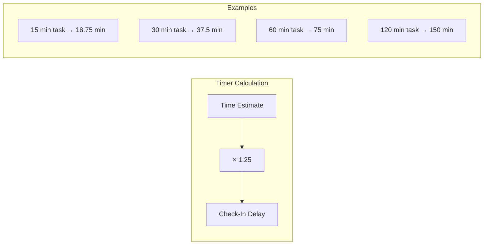

### Repeated Check-Ins

If the user says they're still working or need more time, the timer resets:

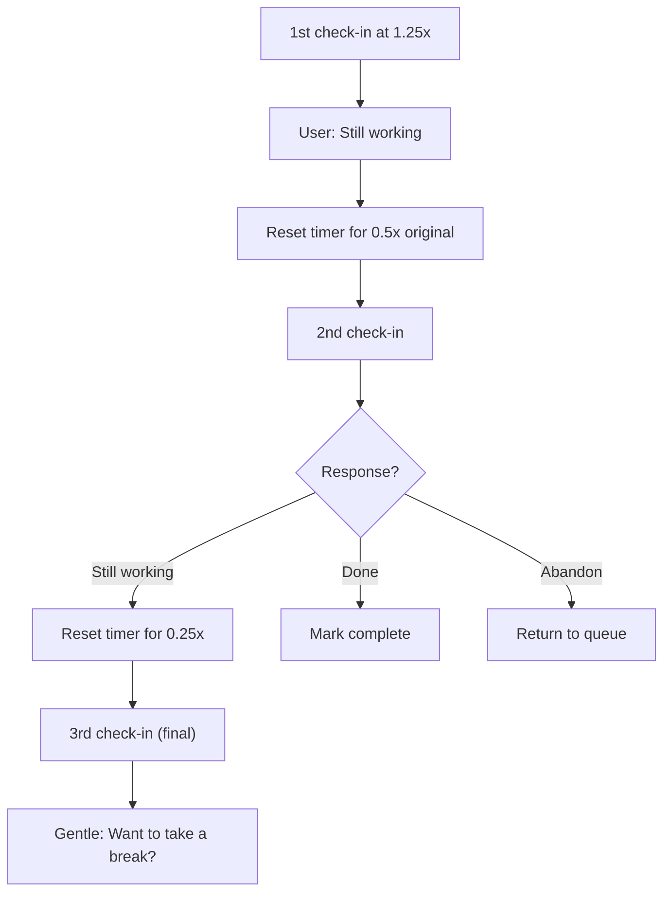

After 3 check-ins without completion, the system gently suggests taking a break rather than continuing to nag.

---

## Module 7: Breakdown Assistance (NEED_HELP)

When a user signals they need help starting or continuing a task, the agent provides specific, actionable guidance. The core principle: **users interpret vague goals as infinite, and thus avoid them.**

```mermaid
flowchart TD
    NeedHelp([User: "How do I start?"]) --> CheckActive{Has active task?}
    CheckActive -->|Yes| AnalyzeState[Determine where user is]
    CheckActive -->|No| SuggestTask[Suggest getting a task first]

    AnalyzeState --> GenerateSteps[Generate concrete next steps]
    GenerateSteps --> DetermineLevel{User confidence level?}

    DetermineLevel -->|Confident| Overview[Provide step overview]
    DetermineLevel -->|Uncertain| CurrentStep[Focus on current step only]
    DetermineLevel -->|Stuck| MicroAction[Provide micro-action]
```

### Breakdown Assistance Prompt

```
The user needs help with their current task. Provide specific, actionable guidance.

CURRENT TASK: {task_title}
TASK SUB-STEPS: {inline_steps or sub_tasks}
USER MESSAGE: "{user_message}"
CONVERSATION CONTEXT: {recent_messages}

ASSISTANCE PHILOSOPHY:
- Users avoid vague goals because they feel infinite
- Concrete, specific actions feel achievable
- The smaller the first step, the easier to start
- Always know what "done" looks like for each step

RESPONSE LEVELS (choose based on user signals):
1. OVERVIEW: List all steps with time estimates (confident user)
2. CURRENT_STEP: Focus on just the next step (uncertain user)
3. MICRO_ACTION: Provide the tiniest possible first action (stuck user)
4. HAND_HOLDING: Extremely detailed, click-by-click guidance (very stuck)

USER SIGNAL DETECTION:
- Confident: "What are the steps?", "Walk me through it"
- Uncertain: "I guess", hesitation, qualified acceptance
- Stuck: "I'm stuck", "I don't know where to start"
- Very stuck: Repeated help requests, frustration signals

OUTPUT (JSON):
{
  "detected_confidence": "confident|uncertain|stuck|very_stuck",
  "response_level": "overview|current_step|micro_action|hand_holding",
  "current_step_number": 1,
  "total_steps": 4,
  "steps_breakdown": [
    {
      "step_number": 1,
      "action": "specific action description",
      "time_estimate": "5 min",
      "done_criteria": "what 'done' looks like"
    }
  ],
  "immediate_action": "the very next thing to do right now",
  "user_message": "conversational response with appropriate detail level",
  "encouragement": "optional brief encouragement if user seems stuck"
}
```

### Proactive Assistance Triggers

The agent should detect hesitation and proactively offer help:

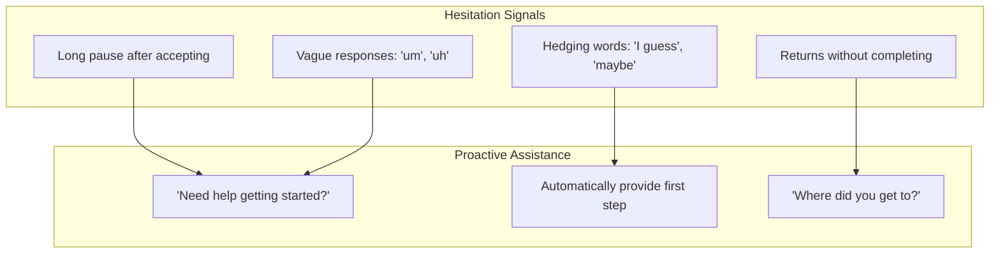

### Response Templates by Level

| Level | Template |
|-------|----------|
| Overview | "Here's the plan: 1) X (5 min), 2) Y (10 min), 3) Z (5 min). Ready to start with X?" |
| Current Step | "Right now, focus on just this: [specific action]. That's it for now." |
| Micro-Action | "Don't worry about the whole thing. Just do this one tiny thing: [micro-action]" |
| Hand-Holding | "Here's exactly what to do: Open [app]. Click [button]. Type [specific text]. Done!" |

### Example Assistance Flows

**Confident User:**
```
User: "What are all the steps for this?"
AI: "Here's the full breakdown:
     1. Draft the outline (15 min)
     2. Write the introduction (20 min)
     3. Fill in each section (30 min)
     4. Review and polish (10 min)

     Total: ~75 min. Start with the outline?"
```

**Uncertain User:**
```
User: "I guess I'll do the report..."
AI: "Let's make this concrete. Your first step:
     → Open a new document and write just the title and your name.

     That's it for now. Let me know when that's done and I'll give you the next piece."
```

**Stuck User:**
```
User: "I don't know where to start"
AI: "Totally fine - let's make this tiny.

     Right now, just open your email and find the original request.
     Don't do anything else yet. Just find it and tell me when you have it open."
```

**Very Stuck User:**
```
User: "I still can't get going"
AI: "I hear you. Let's go even smaller.

     Step 1: Put your phone in another room.
     Step 2: Set a 10-minute timer.
     Step 3: Open [specific app/file].

     Just do step 1 right now. I'll be here when you're back."
```

---

## Structured Output Handling

### JSON Extraction Pattern

```mermaid
flowchart LR
    Response["AI Response with JSON"] --> Parse["Extract JSON block"]
    Parse --> Validate["Validate against schema"]
    Validate --> Use["Use structured data"]
    Validate --> Fallback["Fallback to text parsing"]
```

The AI is instructed to output JSON blocks that can be parsed:

```
AI Response format:
"Here's a casual message for the user."

```json
{
  "action": "...",
  "data": {...}
}
```
```

### Validation Rules

| Field | Validation |
|-------|------------|
| work_type | Must be: focus, creative, social, independent |
| urgency | Integer 0-100 |
| time_estimate_minutes | Positive integer |
| confidence scores | Float 0.0-1.0 |
| task_id | Must exist in Notion database |

---

## Error Handling

```mermaid
flowchart TD
    subgraph Errors["Error Types"]
        API["API Error<br/>(Claude unavailable)"]
        Parse["Parse Error<br/>(Invalid JSON)"]
        Empty["Empty Response"]
        Hallucination["Hallucinated Data<br/>(Non-existent task ID)"]
    end

    subgraph Recovery["Recovery Actions"]
        Retry["Retry with backoff"]
        Fallback["Use text parsing"]
        Default["Use default values"]
        Ignore["Ignore and re-query"]
    end

    API --> Retry
    Parse --> Fallback
    Empty --> Default
    Hallucination --> Ignore
```

### Fallback Behaviors

| Error | Fallback |
|-------|----------|
| Intent unclear | Ask user to clarify |
| Confidence all low | Use defaults, mention uncertainty |
| No matching task | Explain constraints, offer alternatives |
| API failure | "Having trouble thinking - try again?" |

---

## Prompt Versioning

```mermaid
flowchart LR
    subgraph Versions["Prompt Versions"]
        V1["v1.0<br/>Initial release"]
        V2["v1.1<br/>Improved intent"]
        V3["v2.0<br/>Better scoring"]
    end

    V1 --> V2 --> V3

    subgraph Tracking["Version Tracking"]
        Tasks["Tasks store prompt version"]
        Metrics["Track success by version"]
        Rollback["Enable rollback if needed"]
    end
```

Each task stores the prompt version used for its creation, enabling:
- A/B testing of prompt changes
- Performance comparison between versions
- Rollback capability if new prompts perform worse

---

## Conversation State Management

```mermaid
stateDiagram-v2
    [*] --> Idle

    Idle --> Intake: ADD_TASK intent
    Idle --> Selection: GET_TASK intent

    Intake --> Intake: Clarifying
    Intake --> Idle: Task saved

    Selection --> Active: Task accepted
    Selection --> Selection: Task rejected
    Selection --> Idle: No suitable task

    Active --> Idle: Task completed
    Active --> Selection: Task abandoned
    Active --> CheckingIn: Timer expires

    CheckingIn --> Active: Still working
    CheckingIn --> Idle: Task completed
    CheckingIn --> Selection: Task abandoned
```

### State Data

| State | Data Stored |
|-------|-------------|
| Idle | None |
| Intake | Partial task data, conversation history |
| Selection | Current task context |
| Active | Active task ID, start time, check-in count |
| CheckingIn | Active task ID, elapsed time, check-in count |

---

## Example Complete Flow

```mermaid
sequenceDiagram
    participant U as User
    participant I as Intent Module
    participant T as Task Module
    participant S as Selection Module
    participant R as Rejection Module

    U->>I: "I need to finish the report"
    I->>T: ADD_TASK intent
    T->>U: "Got it. When's it due?"
    U->>T: "Friday"
    T->>U: "Added - focus work, ~2 hours, moderate urgency."

    U->>I: "I have 30 minutes, feeling tired"
    I->>S: GET_TASK intent
    S->>U: "How about organizing your files? Light work, 20 min."
    U->>R: "Not that one"
    R->>U: "What's steering you away?"
    U->>R: "Need something more engaging"
    R->>S: Re-score with "engaging" preference
    S->>U: "Try replying to that email from Jake? Social, quick."
    U->>S: "Sure"
    S->>U: "It's yours. Let me know when done!"
```
