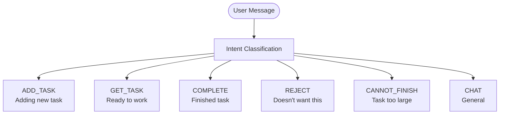
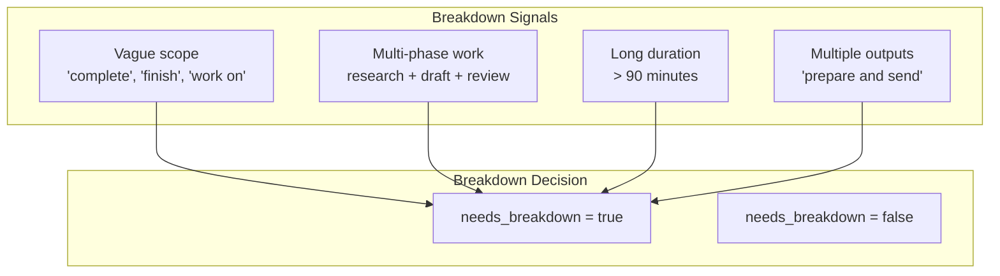

# AI Prompts & Interaction Design

## Overview

hide-my-list uses Claude API for all AI-powered features: intent detection, task intake, label inference, task selection, and rejection handling. This document details the prompt architecture and strategies.

## Prompt Architecture


## Base System Prompt

```
You are hide-my-list, a friendly task management assistant with a unique philosophy:
users should never need to look at their task list. You handle everything.

PERSONALITY:
- Casual and brief - like texting a helpful friend
- Confident in suggestions - trust your algorithm
- Collaborative on rejections - never defensive
- Celebratory on completions - but not over the top

CONSTRAINTS:
- Never show the user their full task list
- Ask at most ONE question at a time
- Keep responses under 50 words unless explaining something complex
- Always be ready to add a task or suggest one

RESPONSE STYLE:
- No emojis unless user uses them first
- No formal greetings ("Hello!", "Thank you for...")
- Use contractions naturally
- Acknowledge briefly, then move forward
```

## Module 1: Intent Detection



### Intent Detection Prompt

```
Classify the user's intent from their message. Return ONLY the intent category.

Categories:
- ADD_TASK: User wants to add a new task (mentions something they need to do)
- GET_TASK: User wants something to work on (mentions time available, asks what to do)
- COMPLETE: User finished their current task (says done, finished, completed)
- REJECT: User doesn't want the suggested task (says no, not that one, something else)
- CANNOT_FINISH: User indicates current task is too large or overwhelming (too big, can't finish, overwhelming)
- CHAT: General conversation or questions

Message: "{user_message}"

Intent:
```

### Intent Detection Examples

| Message | Intent |
|---------|--------|
| "I need to call the dentist" | ADD_TASK |
| "Remind me to buy groceries" | ADD_TASK |
| "What should I do?" | GET_TASK |
| "I have 30 minutes" | GET_TASK |
| "Done!" | COMPLETE |
| "Finished that one" | COMPLETE |
| "Not that one" | REJECT |
| "Something else" | REJECT |
| "This is too big" | CANNOT_FINISH |
| "I can't finish this in one go" | CANNOT_FINISH |
| "This is overwhelming" | CANNOT_FINISH |
| "How does this work?" | CHAT |
| "Hello" | CHAT |

---

## Module 2: Task Intake


### Task Intake Prompt

```
The user wants to add a task. Extract details, infer labels, and evaluate complexity.

User said: "{user_message}"
Previous context: {conversation_history}

Analyze the task and provide structured output:

TASK_ANALYSIS:
- title: (concise task name, max 100 chars)
- work_type: (focus|creative|social|independent)
- work_type_confidence: (0.0-1.0)
- urgency: (0-100)
- urgency_confidence: (0.0-1.0)
- time_estimate_minutes: (number)
- time_confidence: (0.0-1.0)
- energy_required: (high|medium|low)

COMPLEXITY EVALUATION:
Determine if this task needs breakdown into sub-tasks.
- needs_breakdown: true if task is vague, multi-step, or estimated > 90 minutes
- If needs_breakdown=true, create actionable sub-tasks (HIDDEN from user)
- Each sub-task should be completable in 15-90 minutes
- Reframe large tasks as their first achievable step

BREAKDOWN SIGNALS (needs_breakdown=true):
- Vague scope: "complete the project", "finish the report", "work on X"
- Multi-phase: tasks requiring research → draft → review → finalize
- Long duration: estimated > 90 minutes
- Multiple deliverables: "prepare and send", "design and implement"

DECISION:
If any confidence < 0.5, set needs_clarification=true and provide ONE question.
If all confidences >= 0.5, set needs_clarification=false.

OUTPUT (JSON):
{
  "title": "...",
  "work_type": "...",
  "work_type_confidence": 0.0,
  "urgency": 0,
  "urgency_confidence": 0.0,
  "time_estimate_minutes": 0,
  "time_confidence": 0.0,
  "energy_required": "...",
  "needs_clarification": true|false,
  "clarification_question": "..." or null,
  "needs_breakdown": true|false,
  "sub_tasks": [...] or null,
  "presentable_title": "..." (first actionable step if breakdown needed),
  "confirmation_message": "..." (brief confirmation if saving)
}

IMPORTANT: Sub-tasks are NEVER shown to the user. Only present the first
actionable step. The user sees "Added - focus work, ~30 min" not the full breakdown.
```

### Complexity Evaluation Rules



### Task Reframing Examples

| User Says | Presentable Title | Hidden Sub-tasks |
|-----------|-------------------|------------------|
| "Complete the project" | "Draft project outline" | 1. Draft outline, 2. First revision, 3. Review, 4. Finalize |
| "Finish the report" | "Write report introduction" | 1. Introduction, 2. Body sections, 3. Conclusion, 4. Edit |
| "Plan the event" | "List event requirements" | 1. Requirements, 2. Venue research, 3. Budget, 4. Timeline |
| "Prepare presentation" | "Outline presentation" | 1. Outline, 2. Draft slides, 3. Add visuals, 4. Practice |

### Work Type Inference Rules


### Urgency Inference Rules


### Clarifying Questions


**Question Templates:**

| Missing Info | Question |
|--------------|----------|
| Urgency | "Is this time-sensitive, or can it wait?" |
| Time | "About how long do you think this will take?" |
| Work type | "Is this focused thinking or more routine work?" |
| Task unclear | "Can you tell me a bit more about what that involves?" |

---

## Module 3: Task Selection


### Task Selection Prompt

```
Select the best task for the user based on their current context.

USER CONTEXT:
- Available time: {available_minutes} minutes
- Current mood: {mood} (maps to: {preferred_work_type})
- Time of day: {time_of_day}

PENDING TASKS:
{tasks_json}

SCORING RULES:
1. Time Fit (30% weight):
   - Task fits with buffer: 1.0
   - Tight fit (within 10%): 0.5
   - Doesn't fit: 0.0 (EXCLUDE)

2. Mood Match (40% weight):
   - Perfect match: 1.0
   - Related type: 0.5
   - Opposite type: 0.0

3. Urgency (20% weight):
   - Score = urgency / 100

4. History (10% weight):
   - No rejections: 0.1
   - 1-2 rejections: 0.05
   - 3+ rejections: 0.0

MOOD MAPPING:
- "focused/sharp" → prefer focus work
- "creative/inspired" → prefer creative work
- "social/energetic" → prefer social work
- "tired/low energy" → prefer independent work

OUTPUT (JSON):
{
  "selected_task_id": "...",
  "score": 0.0,
  "reasoning": "brief explanation",
  "user_message": "conversational suggestion"
}

If no tasks fit, explain why and suggest alternatives.
```

### Mood to Work Type Affinity


### Selection Message Templates


---

## Module 4: Rejection Handling


### Rejection Handling Prompt

```
The user rejected the suggested task. Understand why and find an alternative.

REJECTED TASK: {task_title}
USER'S REASON: "{rejection_reason}"
REMAINING TASKS: {remaining_tasks_json}
USER CONTEXT: {time} minutes, {mood} mood

REJECTION CATEGORIES:
1. timing - "takes too long", "not enough time"
2. mood_mismatch - "not in the mood", "too tired for that"
3. blocked - "waiting on something", "can't do it yet"
4. already_done - "already did that", "finished already"
5. general - "just not feeling it", vague rejection

ACTIONS BY CATEGORY:
- timing: Suggest shorter task, note time preference
- mood_mismatch: Suggest different work type, avoid this type now
- blocked: Mark as blocked, don't suggest until unblocked
- already_done: Mark as completed, celebrate!
- general: Log rejection, try very different task

OUTPUT (JSON):
{
  "rejection_category": "...",
  "task_update": {
    "rejection_count_increment": 1,
    "rejection_note": "[timestamp] {reason}"
  },
  "alternative_task_id": "..." or null,
  "user_message": "conversational response with alternative"
}
```

### Rejection Response Templates

| Category | Response Template |
|----------|-------------------|
| timing | "Got it - that one's too long right now. How about [shorter task]?" |
| mood_mismatch | "Fair enough. Let me find something more [appropriate mood]. How about [task]?" |
| blocked | "I'll hold off on that one. In the meantime, try [task]?" |
| already_done | "Oh nice, already done! Let me mark that off. Ready for another?" |
| general | "No problem. Here's something different: [very different task]?" |

### Escalation After Multiple Rejections


---

## Module 5: Cannot Finish Handling

When a user indicates they cannot finish a task, we need to understand what was accomplished and break down what remains.

```mermaid
flowchart TD
    CannotFinish([User: "This is too big"]) --> AskProgress[Ask what was accomplished]
    AskProgress --> UserProgress[User describes progress]
    UserProgress --> Analyze[Analyze remaining work]
    Analyze --> CreateSubtasks[Create sub-tasks for remainder]
    CreateSubtasks --> UpdateParent[Update parent task]
    UpdateParent --> OfferNext[Offer next sub-task]
```

### Cannot Finish Prompt

```
The user indicates they cannot finish the current task. Gather progress and break down remaining work.

CURRENT TASK: {task_title}
ORIGINAL TIME ESTIMATE: {time_estimate} minutes
USER MESSAGE: "{user_message}"

STEP 1: Ask what was accomplished
Generate a brief, friendly question to understand their progress.

STEP 2: Once progress is described, analyze remaining work
- What did the user complete?
- What specific work remains?
- How can remaining work be broken into 15-90 minute chunks?

STEP 3: Create sub-tasks for remaining work
- Each sub-task must be specific and actionable
- First sub-task should be the immediate next step
- Sub-tasks are HIDDEN from user

OUTPUT (JSON):
{
  "phase": "ask_progress" | "analyze_remaining",
  "user_message": "...",
  "progress_question": "..." (if phase=ask_progress),
  "completed_portion": "..." (if phase=analyze_remaining),
  "remaining_sub_tasks": [
    {
      "title": "...",
      "time_estimate_minutes": 0,
      "sequence": 1
    }
  ] (if phase=analyze_remaining),
  "next_sub_task_message": "..." (offer first remaining sub-task)
}
```

### Progress Question Templates

| Scenario | Question |
|----------|----------|
| Just started | "No worries - what did you get into before stopping?" |
| Partially done | "Got it. What part did you manage to get done?" |
| Stuck | "That's okay. What's the last thing you completed on this?" |
| Overwhelmed | "Totally understand. Tell me what you accomplished so far." |

### Remaining Work Analysis


### Cannot Finish Response Flow


### Sub-task Creation Rules

| Original Task Type | Typical Breakdown Pattern |
|-------------------|---------------------------|
| Writing task | Outline → Sections → Edit → Finalize |
| Research task | Define scope → Gather sources → Analyze → Summarize |
| Planning task | Requirements → Options → Decision → Documentation |
| Coding task | Design → Implement → Test → Refactor |
| Creative task | Brainstorm → Draft → Iterate → Polish |

**Key Principle:** When a CANNOT_FINISH occurs, it indicates the original breakdown (if any) left tasks too large. The new breakdown should create smaller, more achievable chunks.

---

## Structured Output Handling

### JSON Extraction Pattern


The AI is instructed to output JSON blocks that can be parsed:

```
AI Response format:
"Here's a casual message for the user."

```json
{
  "action": "...",
  "data": {...}
}
```
```

### Validation Rules

| Field | Validation |
|-------|------------|
| work_type | Must be: focus, creative, social, independent |
| urgency | Integer 0-100 |
| time_estimate_minutes | Positive integer |
| confidence scores | Float 0.0-1.0 |
| task_id | Must exist in Notion database |

---

## Error Handling


### Fallback Behaviors

| Error | Fallback |
|-------|----------|
| Intent unclear | Ask user to clarify |
| Confidence all low | Use defaults, mention uncertainty |
| No matching task | Explain constraints, offer alternatives |
| API failure | "Having trouble thinking - try again?" |

---

## Prompt Versioning


Each task stores the prompt version used for its creation, enabling:
- A/B testing of prompt changes
- Performance comparison between versions
- Rollback capability if new prompts perform worse

---

## Conversation State Management


### State Data

| State | Data Stored |
|-------|-------------|
| Idle | None |
| Intake | Partial task data, conversation history |
| Selection | Current task context |
| Active | Active task ID, start time |

---

## Example Complete Flow


