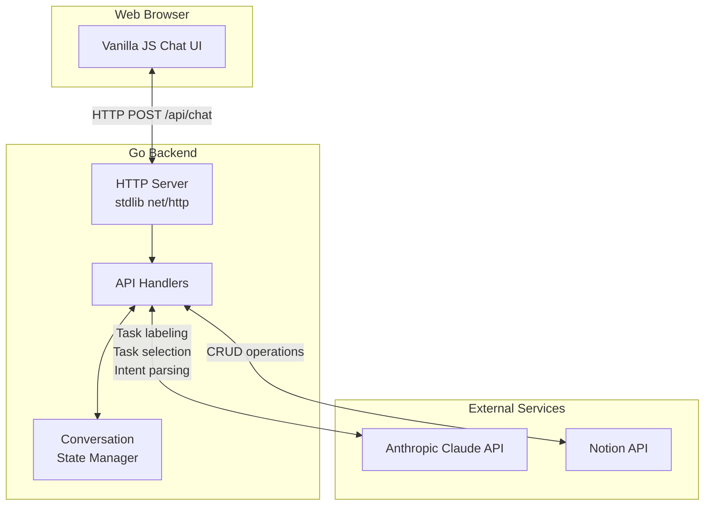
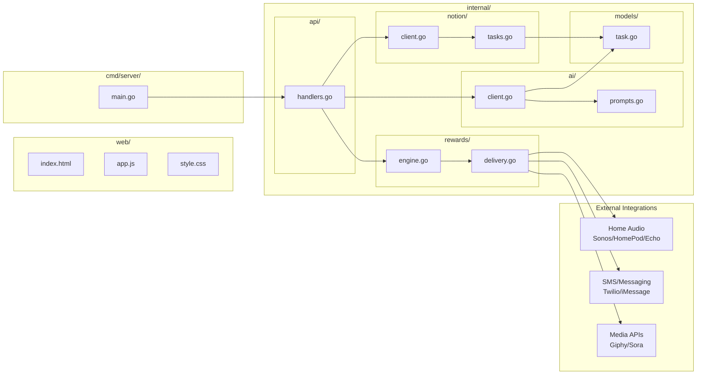
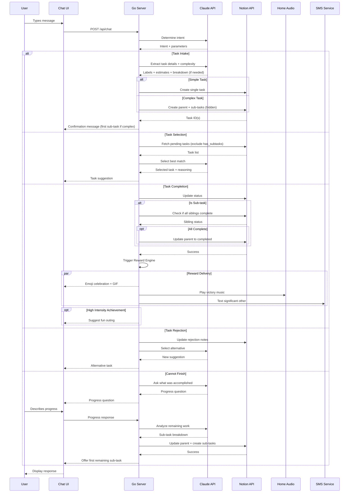
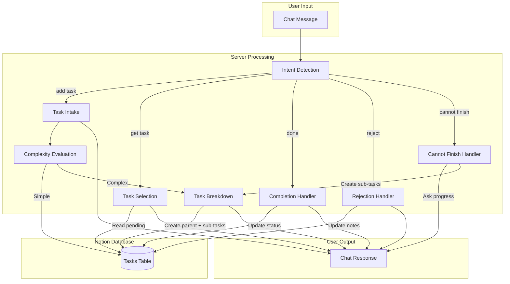
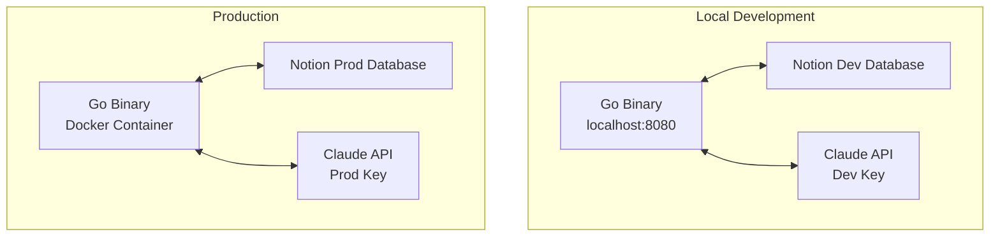

# hide-my-list: System Architecture

## Overview

hide-my-list is an AI-powered task manager where users never directly view their task list. The system uses conversational AI to intake tasks, intelligently label them, and surface the right task at the right time based on user mood, available time, and task urgency.

## High-Level Architecture

## Component Architecture

## Request Flow

## Data Flow

## Deployment Architecture

## Technology Choices

| Component | Technology | Rationale |
|-----------|------------|-----------|
| Backend | Go (stdlib) | Single binary, fast, no framework overhead |
| Frontend | Vanilla JS | No build step, fast iteration |
| Database | Notion | Zero setup, visual backup, rich API |
| AI | Claude API | Strong reasoning, structured output |
| Hosting | Docker | Simple deployment, portable |

## Environment Variables

### Core Services

| Variable | Purpose |
|----------|---------|
| `ANTHROPIC_API_KEY` | Claude API authentication |
| `NOTION_API_KEY` | Notion integration token |
| `NOTION_DATABASE_ID` | Tasks database identifier |
| `PORT` | HTTP server port (default: 8080) |

### Reward System (Optional)

| Variable | Purpose |
|----------|---------|
| `TWILIO_ACCOUNT_SID` | Twilio account for SMS notifications |
| `TWILIO_AUTH_TOKEN` | Twilio authentication token |
| `TWILIO_PHONE_NUMBER` | Sender phone number for SMS |
| `SONOS_API_KEY` | Sonos home audio integration |
| `HOME_ASSISTANT_URL` | Home Assistant endpoint for audio control |
| `HOME_ASSISTANT_TOKEN` | Home Assistant authentication |
| `GIPHY_API_KEY` | Giphy API for celebration GIFs |
| `SORA_API_KEY` | OpenAI Sora for AI-generated celebration videos |
| `OPENWEATHER_API_KEY` | Weather API for outing suggestions |

## Security Considerations

- API keys stored in environment variables, never in code
- Single-user MVP (no authentication initially)
- CORS configured for local development
- Notion integration has minimal required permissions
- No sensitive data stored in conversation state
