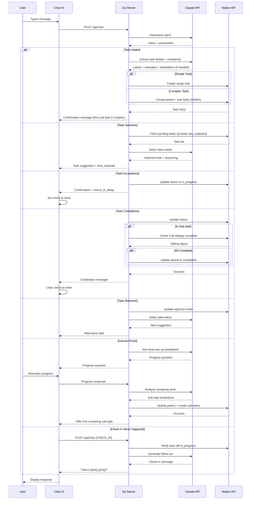
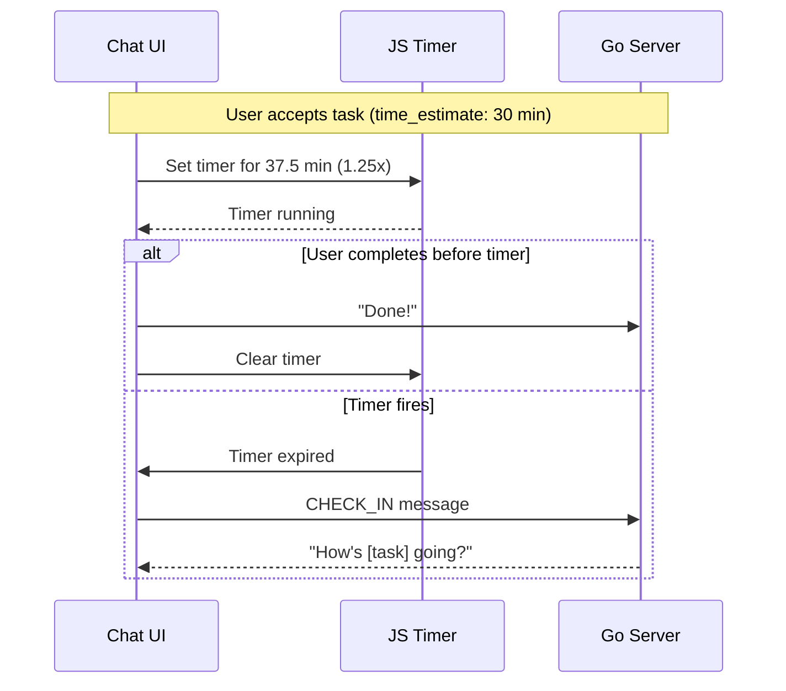

# hide-my-list: System Architecture

## Overview

hide-my-list is an AI-powered task manager where users never directly view their task list. The system uses conversational AI to intake tasks, intelligently label them, and surface the right task at the right time based on user mood, available time, and task urgency.

## High-Level Architecture

## Component Architecture

## Request Flow

## Check-In Timer Flow

## Data Flow

## Deployment Architecture

## Technology Choices

| Component | Technology | Rationale |
|-----------|------------|-----------|
| Backend | Go (stdlib) | Single binary, fast, no framework overhead |
| Frontend | Vanilla JS | No build step, fast iteration |
| Database | Notion | Zero setup, visual backup, rich API |
| AI | Claude API | Strong reasoning, structured output |
| Hosting | Docker | Simple deployment, portable |

## Environment Variables

| Variable | Purpose |
|----------|---------|
| `ANTHROPIC_API_KEY` | Claude API authentication |
| `NOTION_API_KEY` | Notion integration token |
| `NOTION_DATABASE_ID` | Tasks database identifier |
| `PORT` | HTTP server port (default: 8080) |

## Security Considerations

- API keys stored in environment variables, never in code
- Single-user MVP (no authentication initially)
- CORS configured for local development
- Notion integration has minimal required permissions
- No sensitive data stored in conversation state
