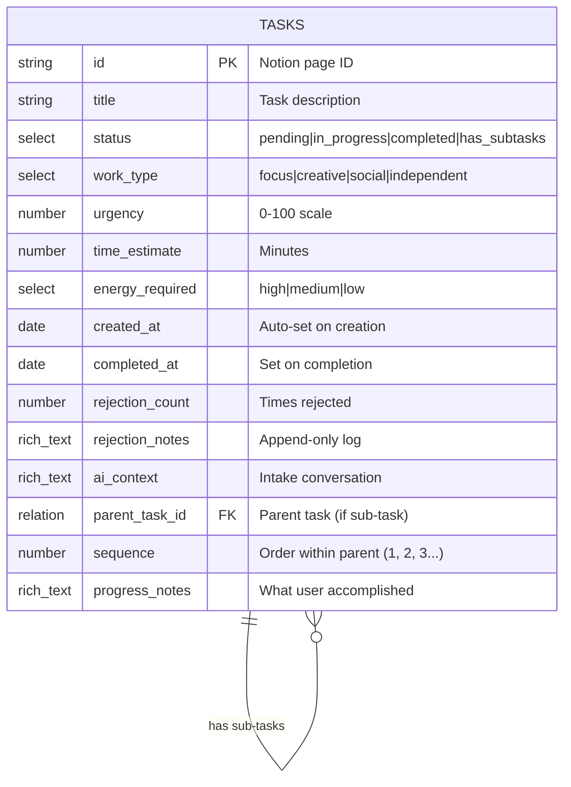

# Notion Database Schema

## Overview

hide-my-list uses Notion as its database, leveraging Notion's API for all CRUD operations. This approach provides zero database setup, a visual backup interface, and rich querying capabilities.

## Database Structure



## Property Definitions

### Title (title)
The main task description as entered by the user.


**Constraints:**
- Required field
- Maximum 200 characters (enforced by application)
- Plain text only

---

### Status (select)

Tracks task lifecycle state.


| Value | Description | Trigger |
|-------|-------------|---------|
| `pending` | Waiting to be worked on | Default on creation |
| `in_progress` | Currently active | User accepts suggestion |
| `completed` | Finished | User marks done |
| `has_subtasks` | Parent task with hidden sub-tasks | Complex task or CANNOT_FINISH |

**Note:** There is no "rejected" status. Rejected tasks return to `pending` with rejection notes appended.

**Note:** Tasks with `has_subtasks` status are never directly suggested to users. Only their pending sub-tasks are surfaced.

---

### WorkType (select)

Categorizes the nature of the work required.


| Value | Energy Level | Example Tasks |
|-------|--------------|---------------|
| `focus` | High | Write report, debug code, analyze data |
| `creative` | Medium-High | Brainstorm ideas, design logo, explore options |
| `social` | Medium | Call client, team meeting, reply to emails |
| `independent` | Low | Organize files, pay bills, book appointments |

---

### Urgency (number)

0-100 scale indicating time sensitivity. **Static** - does not auto-increase.


**Inference Rules:**

| Signal | Urgency Range |
|--------|---------------|
| "today", "ASAP", "urgent" | 81-100 |
| "tomorrow", "soon" | 71-80 |
| "this week", "by Friday" | 51-70 |
| "this month", "next week" | 31-50 |
| "whenever", "no rush" | 0-30 |

---

### TimeEstimate (number)

Estimated minutes to complete the task.


**Inference Guidelines:**

| Task Type | Base Estimate |
|-----------|---------------|
| Phone call | 15 min |
| Email batch | 20 min |
| Quick meeting | 30 min |
| Standard meeting | 60 min |
| Writing (short) | 30-45 min |
| Writing (long) | 90-120 min |
| Coding (bug fix) | 45 min |
| Coding (feature) | 120+ min |

---

### EnergyRequired (select)

Indicates cognitive/physical energy needed.


| Value | Best For | Avoid When |
|-------|----------|------------|
| `high` | Well-rested, morning, caffeinated | Tired, end of day |
| `medium` | Normal energy, mid-day | Exhausted |
| `low` | Tired, low energy, winding down | — |

---

### CreatedAt (date)

Timestamp when task was added. Auto-populated on creation.

```
Format: ISO 8601 (2025-01-04T10:30:00Z)
```

---

### CompletedAt (date)

Timestamp when task was marked complete. Null until completion.


---

### RejectionCount (number)

Number of times user rejected this task when suggested. Starts at 0.


**Impact on Selection:**
- 0 rejections: No penalty
- 1-2 rejections: -0.05 from score
- 3+ rejections: -0.10 from score

---

### RejectionNotes (rich text)

Append-only log of rejection reasons with timestamps.

```
Format:
[2025-01-04 10:30] Not in the mood for focus work
[2025-01-05 14:15] Takes too long right now
[2025-01-06 09:00] Waiting on Sarah's input
```

**Used for:**
- Pattern detection (always rejected at certain times)
- Identifying blocking dependencies
- Learning user preferences

---

### AIContext (rich text)

Stores the original intake conversation for reference.

```
Format:
User: I need to review Sarah's proposal
AI: Got it. Is this time-sensitive?
User: She needs feedback by Friday
AI: Added - focused work, ~30 min, moderate urgency.
```

**Used for:**
- Debugging label assignments
- Providing context when task is suggested
- Improving future intake prompts

---

### ParentTaskId (relation)

Links sub-tasks to their parent task. Null for standalone tasks.


**Constraints:**
- Self-referential relation to same database
- Null for parent tasks and standalone tasks
- Set on sub-task creation

**Note:** This relation is used internally and never exposed to users.

---

### Sequence (number)

Order of sub-task within its parent. Determines which sub-task to offer next.

| Value | Meaning |
|-------|---------|
| 1 | First sub-task (offered first) |
| 2 | Second sub-task |
| 3+ | Subsequent sub-tasks |
| null | Not a sub-task |

**Used for:**
- Determining next sub-task to suggest after completion
- Maintaining logical order of work
- Skipping to later sub-tasks if earlier ones are blocked

---

### ProgressNotes (rich text)

Tracks what the user accomplished, especially during CANNOT_FINISH events.

```
Format:
[2025-01-04 10:30] User started: "outlined the main points"
[2025-01-04 11:00] CANNOT_FINISH: "wrote intro, need to continue with body"
[2025-01-05 09:00] Sub-task 1 completed
```

**Used for:**
- Understanding what work remains after CANNOT_FINISH
- Creating accurate sub-tasks for remaining work
- Providing context when resuming work

---

## Sub-task Relationships


### Parent Task Completion

A parent task automatically moves to `completed` when all its sub-tasks are completed:


---

## API Operations

### Create Task


**Required Fields on Create:**
- Title
- Status: `pending`
- WorkType
- Urgency
- TimeEstimate
- EnergyRequired
- CreatedAt

---

### Query Tasks


**Common Queries:**

| Purpose | Filter |
|---------|--------|
| All pending | `status = "pending"` |
| Short tasks | `status = "pending" AND time_estimate <= 30` |
| High urgency | `status = "pending" AND urgency >= 70` |
| Focus work | `status = "pending" AND work_type = "focus"` |
| Sub-tasks of parent | `parent_task_id = "{parent_id}"` |
| Next sub-task | `parent_task_id = "{parent_id}" AND status = "pending"` (sort by sequence) |
| Standalone tasks only | `parent_task_id IS NULL AND status != "has_subtasks"` |
| Parent tasks | `status = "has_subtasks"` |

---

### Update Task


**Common Updates:**

| Action | Fields Updated |
|--------|----------------|
| Accept task | `status → in_progress` |
| Complete task | `status → completed, completedAt → now` |
| Reject task | `rejectionCount += 1, rejectionNotes += reason` |
| Unblock task | Clear blocked status in rejectionNotes |
| Cannot finish | `status → has_subtasks, progressNotes += progress` |
| Create sub-task | `parent_task_id, sequence, status = pending` |
| Complete sub-task | `status → completed` (check if parent complete) |

---

## Data Flow Diagram


## Notion Setup Instructions

### 1. Create Integration

1. Go to [notion.so/my-integrations](https://www.notion.so/my-integrations)
2. Click "New integration"
3. Name: `hide-my-list`
4. Capabilities: Read, Update, Insert content
5. Copy the "Internal Integration Token"

### 2. Create Database

1. Create a new Notion page
2. Add a full-page database (table view)
3. Add properties matching the schema above
4. Copy the database ID from the URL

```
URL: https://notion.so/abc123...?v=xyz
Database ID: abc123...
```

### 3. Share with Integration

1. Open the database page
2. Click "Share" in the top right
3. Invite your integration by name
4. Grant "Can edit" access

### 4. Configure Environment

```bash
export NOTION_API_KEY="secret_..."
export NOTION_DATABASE_ID="abc123..."
```

## Sample Data

### Standalone Tasks


| Title | WorkType | Urgency | Time | Energy | Status | Parent |
|-------|----------|---------|------|--------|--------|--------|
| Review Sarah's proposal | focus | 65 | 30 | medium | pending | — |
| Call mom | social | 25 | 15 | low | pending | — |
| Organize receipts | independent | 30 | 20 | low | pending | — |
| Book dentist appointment | independent | 15 | 10 | low | completed | — |

### Parent Task with Sub-tasks (Hidden from User)


| Title | WorkType | Urgency | Time | Energy | Status | Parent | Seq |
|-------|----------|---------|------|--------|--------|--------|-----|
| Complete Q4 report | focus | 70 | 165 | high | has_subtasks | — | — |
| Draft outline | focus | 70 | 30 | medium | pending | Q4 report | 1 |
| Write introduction | focus | 70 | 45 | high | pending | Q4 report | 2 |
| Write analysis | focus | 70 | 60 | high | pending | Q4 report | 3 |
| Edit and finalize | focus | 70 | 30 | medium | pending | Q4 report | 4 |

**User Experience:** When the user asks for a task, they see: "How about drafting the outline for the Q4 report? Should take about 30 minutes." They never see the parent task or full breakdown.
