# Reward System

## Overview

The reward system is a core component of hide-my-list designed to provide dopamine-inducing positive reinforcement when users complete tasks or make progress. By leveraging multiple reward channels—both system-generated and interpersonal—we create a powerful motivation loop that keeps users engaged and productive.

## Reward Philosophy


The reward system operates on the principle that **completing tasks should feel genuinely rewarding**. We achieve this through:

1. **Immediate gratification** - Instant visual/audio feedback
2. **Social reinforcement** - Loved ones acknowledge achievements
3. **Anticipatory pleasure** - Suggestions for enjoyable activities

---

## Reward Architecture


---

## System-Generated Rewards

### Emoji Celebrations

Emoji-loaded congratulations messages that scale with achievement significance.

```mermaid
flowchart LR
    subgraph Intensity["Celebration Intensity"]
        Low["Single Task<br/>Completed"]
        Medium["Difficult Task<br/>or 3-task Streak"]
        High["Major Milestone<br/>or 5+ Streak"]
        Epic["Parent Task Complete<br/>or Day Clear"]
    end

    subgraph Output["Emoji Output"]
        LowEmoji["Nice work! ✨"]
        MedEmoji["Crushing it! 🎉✨💪"]
        HighEmoji["UNSTOPPABLE! 🔥🎉✨💪🚀"]
        EpicEmoji["LEGENDARY! 🏆👑🔥🎉✨💪🚀⭐"]
    end

    Low --> LowEmoji
    Medium --> MedEmoji
    High --> HighEmoji
    Epic --> EpicEmoji
```



#### Celebration Message Templates

| Trigger | Intensity | Example Messages |
|---------|-----------|------------------|
| Single task | Low | "Nice work! ✨", "Done! 💫", "Got it! ✅" |
| Quick task (< 15 min) | Low | "Speed demon! ⚡", "Quick win! 🎯" |
| Focus task complete | Medium | "Deep work done! 🧠✨", "Focus mode: crushed! 💪🎯" |
| 3-task streak | Medium | "Hat trick! 🎩✨🎉", "Three down! 🔥💪" |
| 5-task streak | High | "On fire! 🔥🔥🔥✨💪", "Unstoppable! 🚀🎉💪" |
| Difficult task | High | "Beast mode! 💪🔥🎉", "Conquered! ⚔️✨🏆" |
| Parent task (all subs done) | Epic | "MAJOR WIN! 🏆👑🎉✨🔥", "PROJECT COMPLETE! 🚀⭐💪🎊" |
| All tasks cleared | Epic | "INBOX ZERO! 🏆👑✨🎉🔥💪🚀", "LEGENDARY DAY! 👑⭐🏆🎊" |

---

### Animated GIF Celebrations

Fun, culturally relevant GIFs that bring joy and humor to task completion.


#### GIF Source Configuration

| Category | Example GIFs | Trigger Weight |
|----------|--------------|----------------|
| taylor_swift_party | T-Swift celebrating, dancing | High for major wins |
| office_celebration | Jim/Pam high five, Michael dancing | Medium tasks |
| animal_celebration | Dancing cats, excited dogs | Quick wins |
| movie_moments | Victory scenes, celebrations | Streaks |
| custom_sora | AI-generated celebration videos | Epic achievements |

#### User Preference Learning

```mermaid
flowchart LR
    subgraph Input["User Signals"]
        Like["❤️ Reaction"]
        Share["Shared GIF"]
        Skip["Quickly dismissed"]
    end

    subgraph Learning["Preference Model"]
        Weight["Adjust category weights"]
        Style["Learn humor style"]
        Avoid["Reduce disliked types"]
    end

    subgraph Output["Personalized Selection"]
        Favorites["More favorites"]
        Fresh["New discoveries"]
    end

    Input --> Learning
    Learning --> Output
```



---

### AI-Generated Video Celebrations (Sora Integration)

For truly epic achievements, the system can generate custom celebration videos using Sora.


#### Video Prompt Templates

| Achievement Type | Prompt Template |
|-----------------|-----------------|
| Project complete | "Celebratory confetti explosion with [user_name] written in sparkles, joyful upbeat energy" |
| Week cleared | "Sunset celebration scene, victorious figure silhouette, peaceful accomplishment" |
| Difficult task | "Epic mountain summit moment, clouds parting, triumphant achievement" |
| Streak milestone | "Fireworks display spelling out [streak_count], night sky celebration" |

---

### Music Playback (Home Audio Integration)

Leverage home automation systems to play celebratory music when tasks are completed.


#### Music Playback Configuration


#### Example Music Triggers

| Achievement | Music Selection | Duration |
|-------------|-----------------|----------|
| Quick task | Random from "Victory Jingles" | 15 seconds |
| Focus task | Random from "Triumphant" | 30 seconds |
| Major milestone | User's favorite song | Full song |
| All tasks cleared | "We Are The Champions" | Full song |

#### Home Automation Integration Points

| System | Integration Method | Notes |
|--------|-------------------|-------|
| Sonos | Sonos API | Direct HTTP calls |
| Apple HomePod | HomeKit/Shortcuts | Via Shortcuts automation |
| Amazon Echo | Alexa Skills | Custom skill or routines |
| Google Home | Google Home API | Cast-enabled playback |
| Home Assistant | REST API | Universal bridge for any system |
| Custom | MQTT | Publish to configured topic |

---

## Interpersonal Rewards

### Text Significant Other

Automatically notify a loved one when the user completes tasks, creating external positive reinforcement and social accountability.


#### Notification Configuration

| Setting | Options | Default |
|---------|---------|---------|
| recipient | Phone number or contact ID | Required |
| delivery_method | sms, imessage, whatsapp, telegram | sms |
| frequency_limit | 1-10 per day | 3 |
| min_significance | low, medium, high, epic | medium |
| active_hours | Time range | 9am-9pm |
| task_opt_in | all, tagged, manual | tagged |

#### Message Templates

```mermaid
flowchart LR
    subgraph Style["Message Styles"]
        Casual["Casual<br/>'Hey! [Name] just crushed [task]!'"]
        Supportive["Supportive<br/>'[Name] finished [task]! Maybe tell them nice work?'"]
        Celebratory["Celebratory<br/>'🎉 [Name] completed [task]! Celebration time!'"]
        Informative["Informative<br/>'FYI: [Name] completed [task]'"]
    end
```



| Trigger | Example Message |
|---------|-----------------|
| Single task | "Hey! [Name] just finished '[task]' - maybe give them a high five later? 🙌" |
| Streak (3+) | "[Name] is on a roll - [N] tasks done today! 🔥" |
| Difficult task | "[Name] just conquered a big one: '[task]'. They might need a hug! 💪" |
| Parent complete | "BIG NEWS: [Name] finished the entire '[project]'! Celebration dinner? 🎉" |
| All cleared | "[Name] cleared their ENTIRE task list! This calls for ice cream 🍦" |

#### Privacy & Consent


---

### Outing Suggestions

After completing tasks (especially difficult ones), suggest fun activities aligned with user interests to create anticipation and self-reward.


#### User Interest Configuration


#### Suggestion Templates

| Context | Example Suggestions |
|---------|---------------------|
| After focus work (tired) | "You've earned a break! How about grabbing a coffee from [favorite_cafe]? ☕" |
| After physical task | "Nice work! Maybe reward yourself with [favorite_food] from [restaurant]? 🍕" |
| Friday afternoon | "Weekend's calling! Movie night with [partner] at [theater]? 🎬" |
| All tasks cleared | "EVERYTHING DONE! Time for an adventure - what about [saved_activity]? 🎉" |
| Long streak | "5 tasks in a row! You deserve [favorite_treat] 🏆" |
| Morning completion | "Great start! Save room for [lunch_spot] later? 🌮" |

#### External Integrations

| Service | Use Case |
|---------|----------|
| Google Maps | Location search, directions |
| Yelp API | Restaurant recommendations |
| Weather API | Weather-appropriate suggestions |
| Calendar | Check availability |
| Partner's calendar | Coordinate joint activities |

---

## Reward Scaling Algorithm

```mermaid
flowchart TD
    subgraph Input["Reward Inputs"]
        TaskDifficulty["Task Difficulty<br/>time + energy"]
        StreakCount["Current Streak"]
        TimeOfDay["Time of Day"]
        RecentRewards["Recent Reward History"]
        UserPrefs["User Preferences"]
    end

    subgraph Calculate["Intensity Calculation"]
        Base["Base Score<br/>from task difficulty"]
        Multiplier["Streak Multiplier<br/>1.0 + (streak × 0.1)"]
        Diminishing["Diminishing Returns<br/>reduce if many recent rewards"]
        Cap["Cap at intensity level"]
    end

    subgraph Output["Reward Selection"]
        Intensity["Intensity Level<br/>low|medium|high|epic"]
        Channels["Active Channels"]
        Content["Specific Content"]
    end

    Input --> Calculate
    Calculate --> Output
```



### Intensity Levels

| Level | Score Range | Emoji Count | GIF | Music | Video | Text SO | Outing |
|-------|-------------|-------------|-----|-------|-------|---------|--------|
| Low | 0-25 | 1-2 | No | No | No | No | No |
| Medium | 26-50 | 2-4 | Maybe | Maybe | No | Maybe | No |
| High | 51-75 | 4-6 | Yes | Yes | No | Yes | Maybe |
| Epic | 76-100 | 6+ | Yes | Yes | Yes | Yes | Yes |

### Score Calculation

```
base_score = (time_estimate / 15) * 10 + (energy_level * 10)
streak_bonus = streak_count * 5
milestone_bonus = is_parent_complete ? 25 : 0
milestone_bonus += is_all_cleared ? 50 : 0

raw_score = base_score + streak_bonus + milestone_bonus
diminishing = max(0, (rewards_in_last_hour - 2) * 10)

final_score = min(100, max(0, raw_score - diminishing))
```

---

## Configuration Schema

### User Preferences (stored in Notion or local config)


---

## Integration with Existing Flows

### Completion Flow Enhancement

```mermaid
sequenceDiagram
    participant U as User
    participant AI as AI Assistant
    participant R as Reward Engine
    participant HA as Home Audio
    participant SMS as SMS Service
    participant N as Notion

    U->>AI: "Done!"
    AI->>N: Update task status → completed
    AI->>R: Trigger reward evaluation

    R->>R: Calculate intensity score
    R->>R: Select reward channels

    par Parallel Reward Delivery
        R->>AI: Emoji celebration message
        R->>AI: Selected GIF
        R->>HA: Play victory music
        R->>SMS: Text significant other
    end

    AI->>U: "CRUSHED IT! 🔥💪✨ [GIF: Taylor Swift dancing]"

    opt High intensity + cleared schedule
        R->>AI: Outing suggestion
        AI->>U: "You've earned it - coffee at Luna Cafe? ☕"
    end
```



### State Diagram Update


---

## API Endpoints

### Reward Configuration

| Endpoint | Method | Purpose |
|----------|--------|---------|
| `/api/rewards/config` | GET | Get current reward settings |
| `/api/rewards/config` | PUT | Update reward settings |
| `/api/rewards/music/test` | POST | Test music integration |
| `/api/rewards/sms/test` | POST | Test SMS delivery |
| `/api/rewards/history` | GET | Get recent reward history |

### Home Automation Integration

| Endpoint | Method | Purpose |
|----------|--------|---------|
| `/api/home/status` | GET | Check home system connectivity |
| `/api/home/rooms` | GET | List available rooms |
| `/api/home/play` | POST | Trigger music playback |
| `/api/home/stop` | POST | Stop current playback |

---

## Environment Variables

| Variable | Purpose | Example |
|----------|---------|---------|
| `TWILIO_ACCOUNT_SID` | Twilio authentication | `ACxxxxxxxx` |
| `TWILIO_AUTH_TOKEN` | Twilio authentication | `xxxxxxxx` |
| `TWILIO_PHONE_NUMBER` | Sender phone number | `+1234567890` |
| `SONOS_API_KEY` | Sonos integration | `xxxxxxxx` |
| `HOME_ASSISTANT_URL` | Home Assistant endpoint | `http://ha.local:8123` |
| `HOME_ASSISTANT_TOKEN` | Home Assistant auth | `xxxxxxxx` |
| `SORA_API_KEY` | OpenAI Sora access | `sk-xxxxxxxx` |
| `GIPHY_API_KEY` | GIF search | `xxxxxxxx` |
| `OPENWEATHER_API_KEY` | Weather for outings | `xxxxxxxx` |

---

## Implementation Phases


---

## Success Metrics

| Metric | Target | Measurement |
|--------|--------|-------------|
| Task completion rate | +20% | Compare before/after |
| Session duration | +15% | Average time in app |
| Return rate | +25% | Users returning within 24h |
| Streak length | +30% | Average consecutive completions |
| User satisfaction | 4.5/5 | Post-session survey |
| Reward engagement | 80%+ | Rewards not dismissed immediately |
