# Task Lifecycle

## Overview

A task in hide-my-list goes through several states from creation to completion. This document details each phase of that journey.

## Complete Task Lifecycle

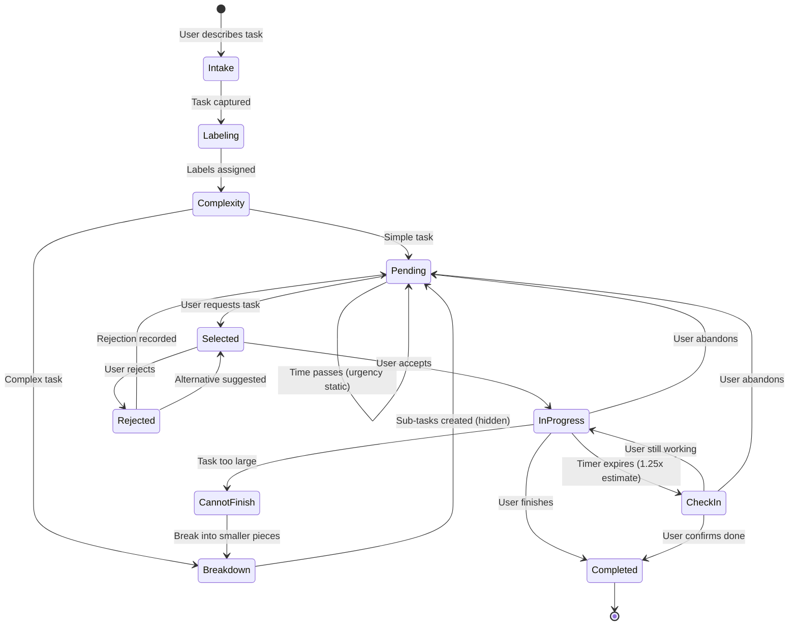

## Task States

| State | Description | Notion Status |
|-------|-------------|---------------|
| Intake | Task being captured, AI asking questions | N/A (not yet saved) |
| Labeling | AI assigning work type, urgency, time estimate | N/A (not yet saved) |
| Complexity | AI evaluating if task needs breakdown | N/A (not yet saved) |
| Breakdown | AI creating sub-tasks (hidden from user) | N/A (parent) / `pending` (sub-tasks) |
| Pending | Task saved, waiting to be selected | `pending` |
| Selected | Task suggested to user, awaiting response | `pending` |
| In Progress | User actively working on task | `in_progress` |
| Check-In | System following up on task progress | `in_progress` |
| Rejected | User declined, giving feedback | `pending` |
| Cannot Finish | User indicates task is too large | `in_progress` (triggers breakdown) |
| Completed | Task finished | `completed` |

## Phase 1: Task Intake

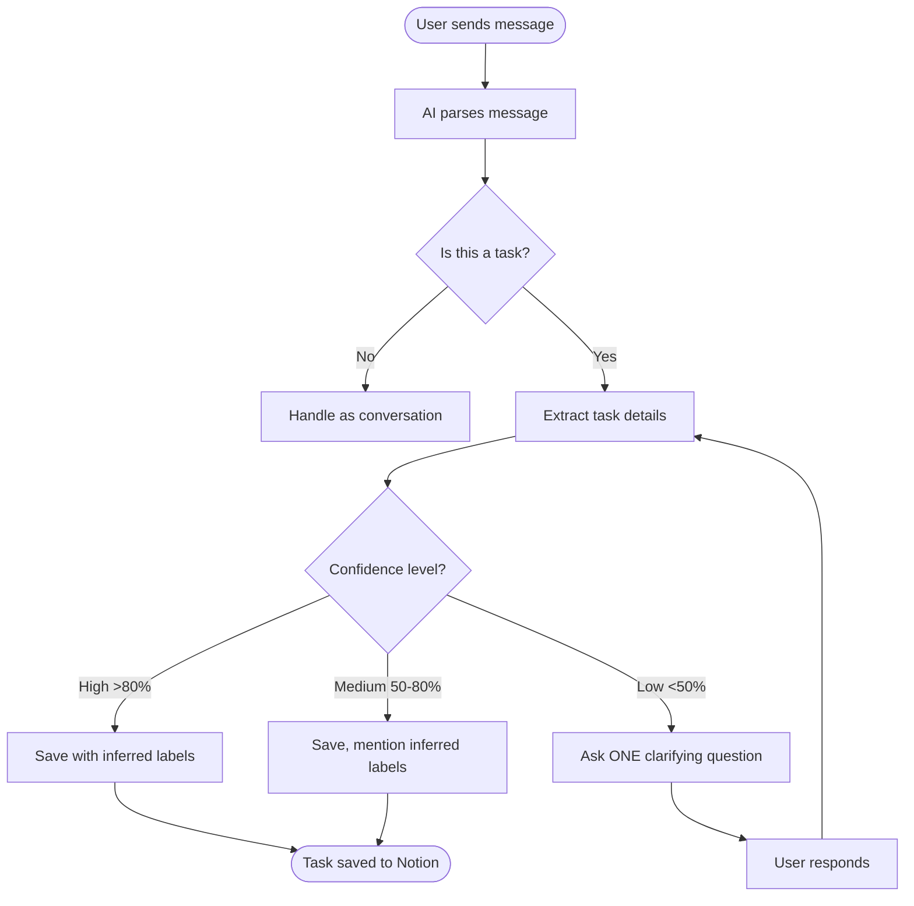

## Phase 2: Label Assignment

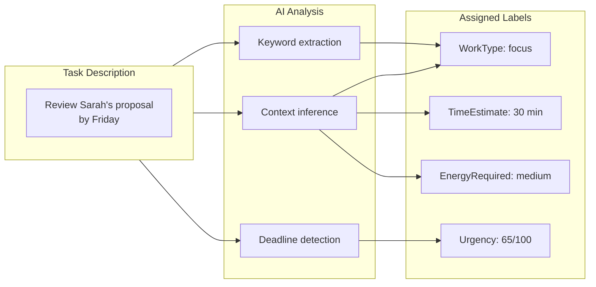

### Label Inference Rules

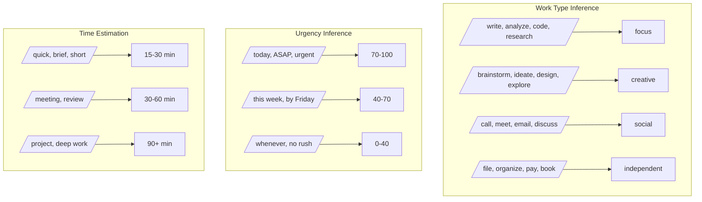

## Phase 2.5: Sub-task Generation (All Tasks)

After labeling, the AI **always** generates a series of actionable sub-tasks for every task. This is a core principle: **users interpret vague goals as infinite, and thus avoid them.** By providing clear, specific sub-tasks upfront, we give users a defined path forward.

**Key Principle:** Every task, no matter how simple it appears, gets explicit sub-tasks that define exactly what "done" looks like.

**Key Enhancement:** Sub-tasks are personalized based on user preferences to create an environment for success. The first 1-2 steps focus on preparation and comfort.

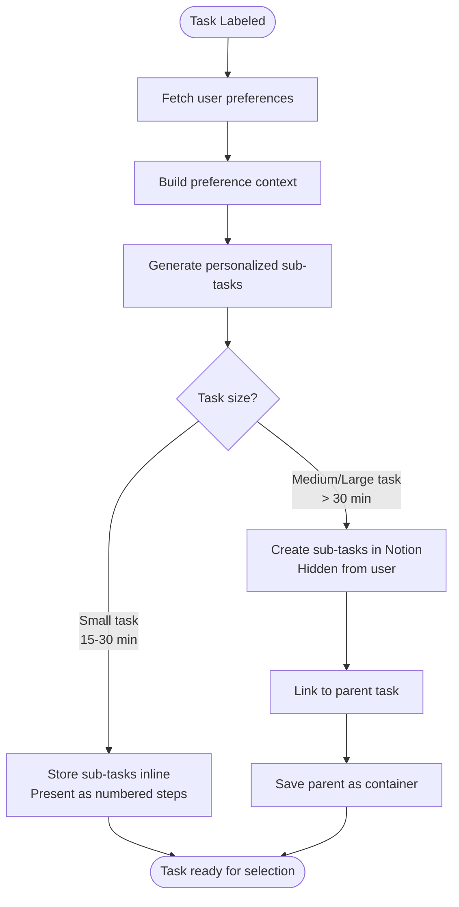

### Why All Tasks Get Sub-tasks

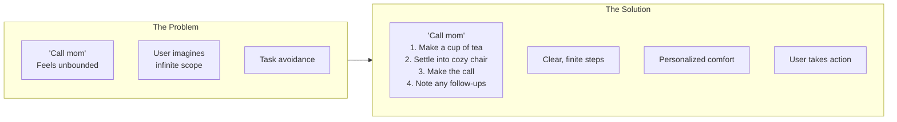

### Personalized Prep Steps

Before generating core task steps, the system fetches user preferences and injects them into the breakdown prompt. This enables personalized "environment for success" steps.

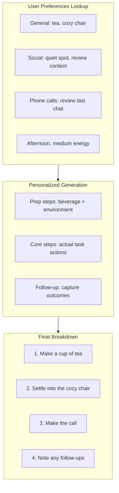

See [user-preferences.md](./user-preferences.md) for full preference system documentation.

### Sub-task Generation Rules

| Task Type | Sub-task Approach | Example (with preferences: tea, cozy chair) |
|-----------|-------------------|---------|
| Quick (15 min) | 2-4 inline steps | "Call mom" → 1. Make tea, 2. Settle into cozy chair, 3. Make call, 4. Note follow-ups |
| Standard (30-60 min) | 3-6 inline steps | "Review proposal" → 1. Make coffee, 2. Find quiet spot, 3. Read intro, 4. Check numbers, 5. Note concerns, 6. Draft feedback |
| Large (60+ min) | Hidden sub-tasks | "Complete report" → 4+ separate tasks in Notion (each with prep steps) |

### Complexity Signals (For Hidden vs. Inline)

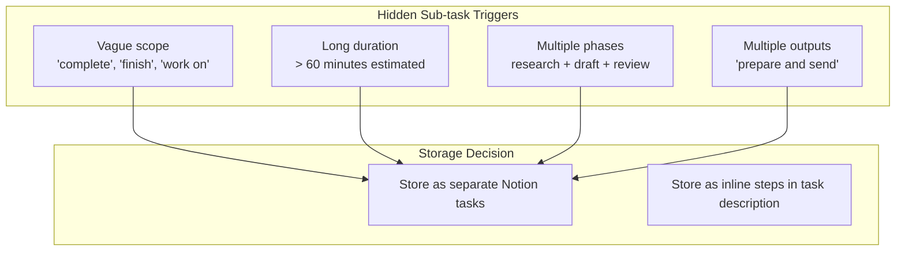

### Sub-task Structure

When a task is broken down, the system creates:
- **Parent task**: The original task description (status: `has_subtasks`)
- **Sub-tasks**: Actionable pieces (status: `pending`, linked to parent)

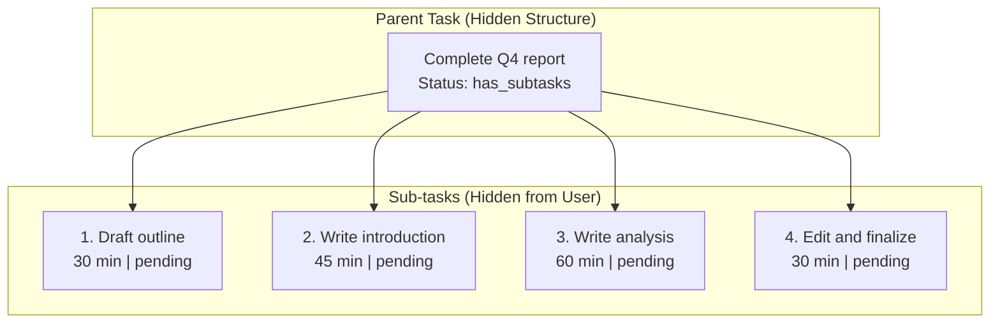

**User Experience:** When a task is suggested, the user sees the actionable first step along with a brief summary of what completing the full task involves:

- For inline steps: "How about calling mom? Here's the plan: 1) Find a quiet spot, 2) Make the call, 3) Note any follow-ups. Should take about 15 minutes."
- For hidden sub-tasks: "How about drafting the outline for the Q4 report? This is the first of 4 steps to complete the full report. Should take about 30 minutes."

### On-Demand Breakdown Assistance

The agent must always stand ready to help users further break down tasks. When a user starts a task or expresses hesitation, the agent proactively offers specific suggestions for how to approach the work.

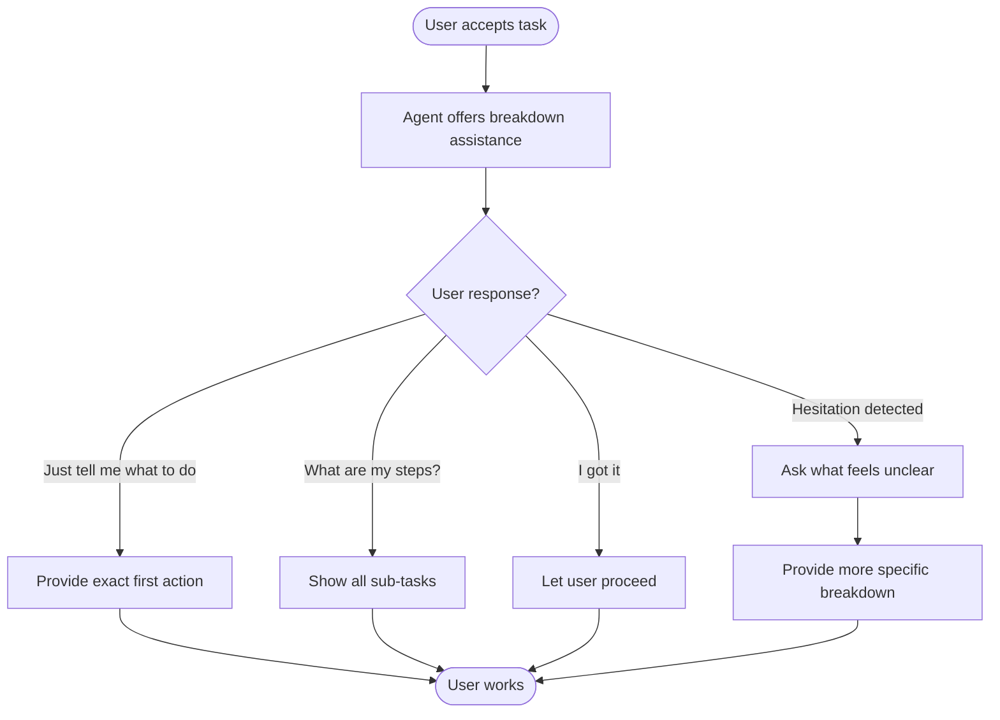

**Key Behaviors:**
- Agent never assumes user knows what to do next
- Agent always has specific, concrete next actions ready
- If user seems stuck, agent proactively offers smaller sub-tasks
- User should never have to figure out "how" on their own

### Task Reframing

| User Says | What User Sees (personalized) | Hidden Reality |
|-----------|-------------------------------|----------------|
| "Complete the project" | "Make coffee, then draft project outline - 35 min" | 4 sub-tasks created (each with personalized prep) |
| "Finish the report" | "Find your quiet spot, then write report introduction - 50 min" | 4 sub-tasks created |
| "Plan the event" | "Grab a tea and list event requirements - 25 min" | 5 sub-tasks created |
| "Call mom" | "Make tea, settle into cozy chair, make call - 15 min" | Inline steps with prep |

## Phase 3: Task Selection

```mermaid
flowchart TD
    Request([User: "I have 30 min, feeling tired"]) --> Parse[Parse time + mood]
    Parse --> Fetch[Fetch pending tasks from Notion]
    Fetch --> Score[Score each task]

    subgraph Scoring["Scoring Algorithm"]
        TimeFit[Time Fit × 0.3]
        MoodMatch[Mood Match × 0.4]
        UrgencyScore[Urgency × 0.2]
        History[History Bonus × 0.1]

        TimeFit --> Total[Total Score]
        MoodMatch --> Total
        UrgencyScore --> Total
        History --> Total
    end

    Score --> Scoring
    Total --> Select[Select highest score]
    Select --> Present([Present to user])
```

### Scoring Details

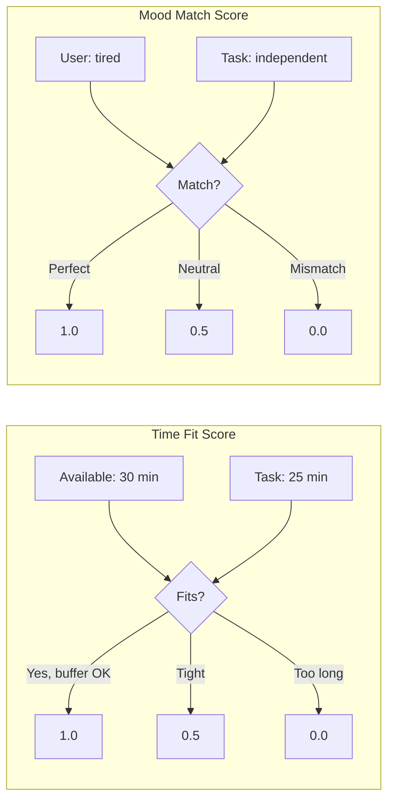

### Mood to Work Type Matching

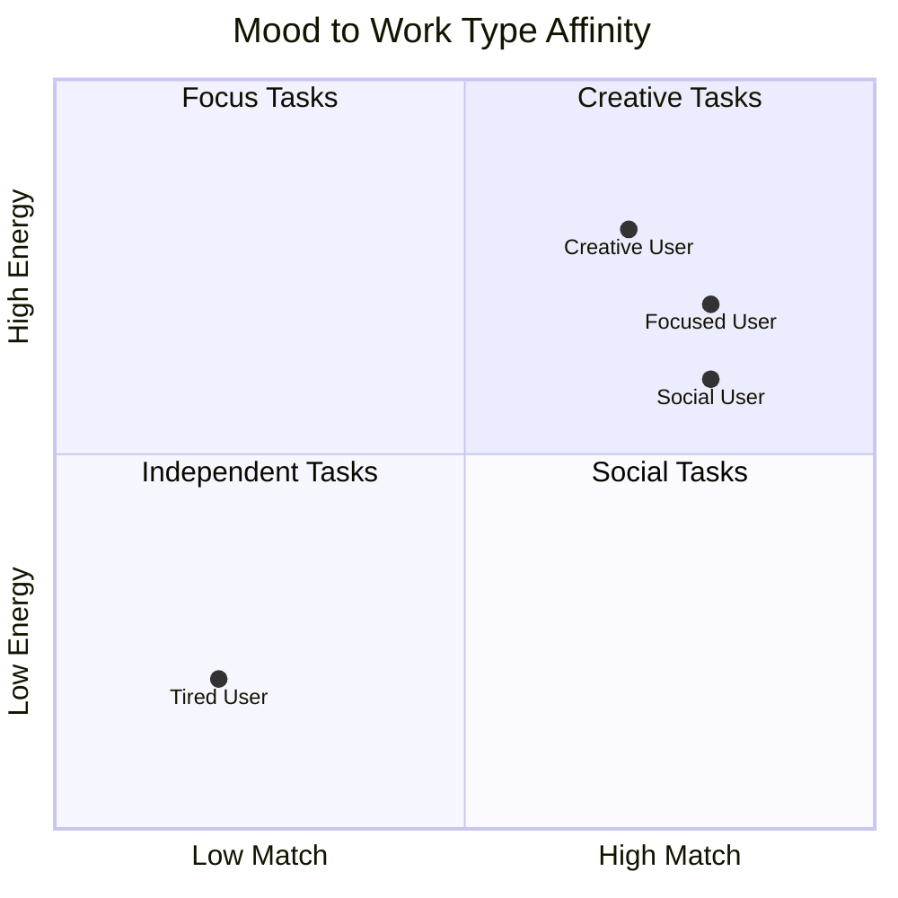

## Phase 4: Task Execution

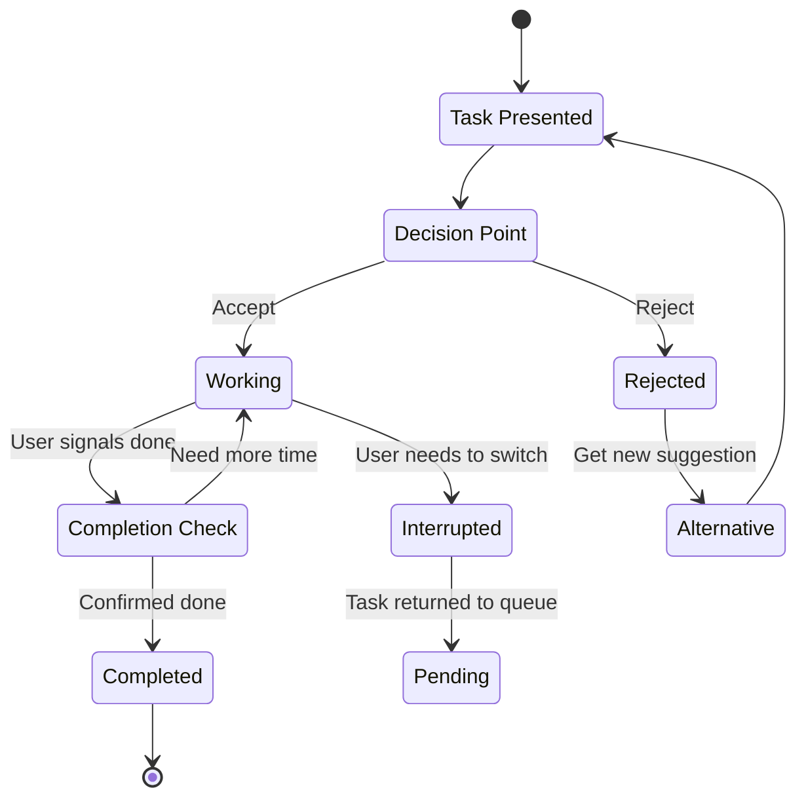

## Phase 5: Check-In Follow-Up

When a user accepts a task, the system sets a timer for 1.25x the estimated time. If the user hasn't marked the task complete, the system proactively checks in.

```mermaid
flowchart TD
    Accept([User accepts task]) --> SetTimer[Set timer: estimate × 1.25]
    SetTimer --> Wait[Timer running...]

    Wait --> TimerFires{Timer expires}
    Wait --> UserDone[User says "Done!"]

    UserDone --> ClearTimer[Clear timer]
    ClearTimer --> Complete([Mark completed])

    TimerFires --> CheckStatus{Task still in_progress?}

    CheckStatus -->|No| Skip[Already completed/abandoned]
    CheckStatus -->|Yes| AskUser["How's [task] going?"]

    AskUser --> Response{User response}

    Response --> Done["Done!"]
    Response --> Working["Still working"]
    Response --> Distracted["Got distracted"]
    Response --> NeedMore["Need more time"]
    Response --> Abandon["Want to stop"]

    Done --> Complete
    Working --> ResetTimer1[Reset timer: 0.5x original]
    Distracted --> Nudge["Want to jump back in?"]
    NeedMore --> AskHow["How much longer?"]
    Abandon --> ReturnQueue[Return to pending]

    ResetTimer1 --> Wait2[Timer running...]
    Nudge --> Response2{User choice}
    AskHow --> NewTime[User gives time]

    Response2 -->|Yes| ResetTimer2[Reset timer]
    Response2 -->|No| ReturnQueue

    NewTime --> ResetTimer3[Set new timer]
    ResetTimer2 --> Wait2
    ResetTimer3 --> Wait2

    Wait2 --> CheckIn2{2nd check-in}
    CheckIn2 --> FinalResponse{Response?}

    FinalResponse -->|Done| Complete
    FinalResponse -->|Still working| CheckIn3[3rd check-in]
    FinalResponse -->|Abandon| ReturnQueue

    CheckIn3 --> Gentle["Maybe take a break?<br/>I'll be here when you're ready."]
```

### Check-In Timing Examples

| Time Estimate | First Check-In | Subsequent Check-Ins |
|---------------|----------------|----------------------|
| 15 min | 18.75 min | +7.5 min, +3.75 min |
| 30 min | 37.5 min | +15 min, +7.5 min |
| 60 min | 75 min | +30 min, +15 min |
| 120 min | 150 min | +60 min, +30 min |

### Check-In Response Handling

| Response | Action | Timer |
|----------|--------|-------|
| "Done!" | Mark completed | Clear |
| "Still working" | Encourage | Reset to 0.5x |
| "Got distracted" | Gentle nudge | Reset to 0.5x if continuing |
| "Need X more minutes" | Acknowledge | Set to X × 1.25 |
| "Want to stop" | Return to queue | Clear |

### Maximum Check-Ins

The system limits check-ins to 3 per task session to avoid nagging:

1. **1st check-in**: Friendly inquiry
2. **2nd check-in**: Brief follow-up
3. **3rd check-in**: Suggest taking a break, stop checking in

If the user returns later and re-accepts the same task, the check-in count resets.

## Phase 6: Rejection Handling

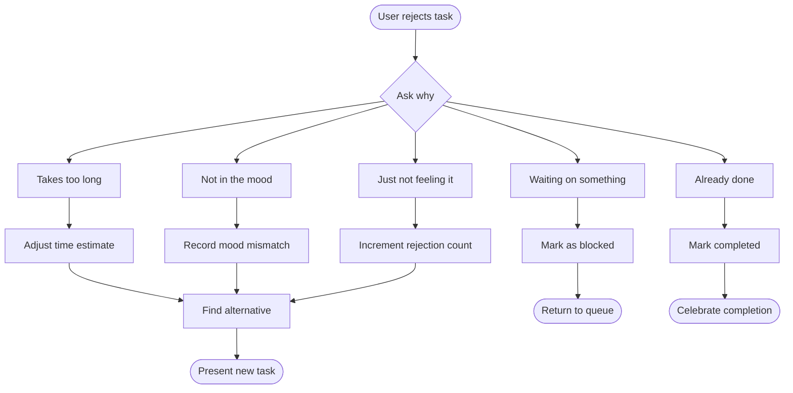

### Rejection Learning

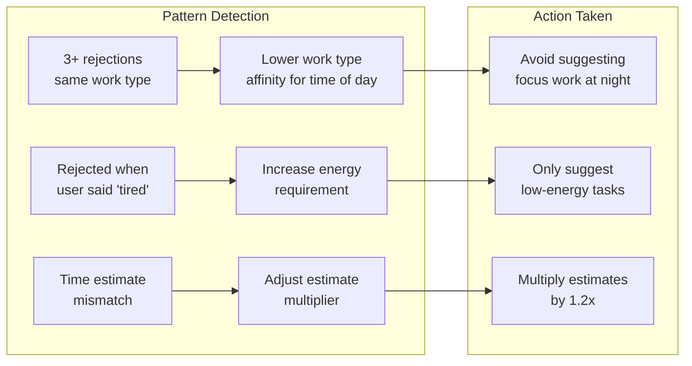

## Phase 5.5: Cannot Finish (Re-breakdown)

When a user indicates they cannot finish a task, the system gathers progress information and creates new sub-tasks for the remaining work.

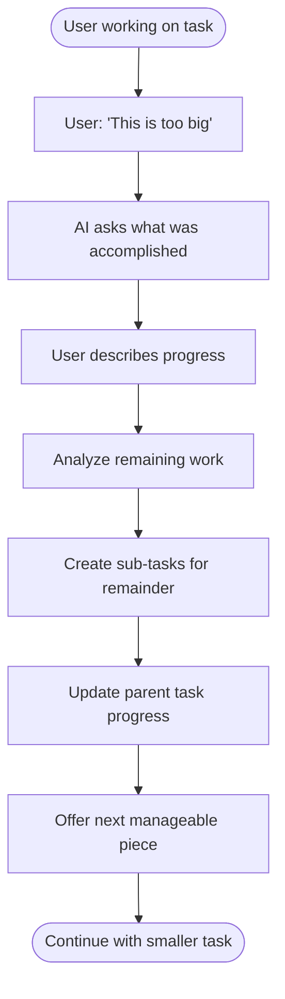

### Progress Gathering

The AI must always ask what the user accomplished before breaking down remaining work:

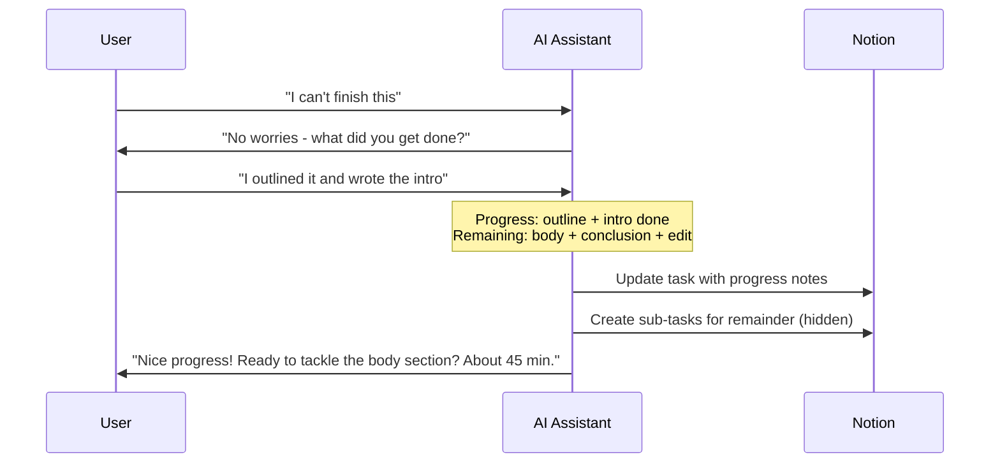

### Re-breakdown Rules

| Scenario | Action |
|----------|--------|
| First CANNOT_FINISH | Ask progress → Break into 3-5 sub-tasks |
| Second CANNOT_FINISH | Break current sub-task into 2-3 smaller pieces |
| Third+ CANNOT_FINISH | Ask what specific part is blocking → Create atomic tasks |

### Learning from Cannot Finish

Each CANNOT_FINISH signal teaches the system:
- Original time estimates may be too aggressive
- Task scope was underestimated
- Future similar tasks should be pre-broken

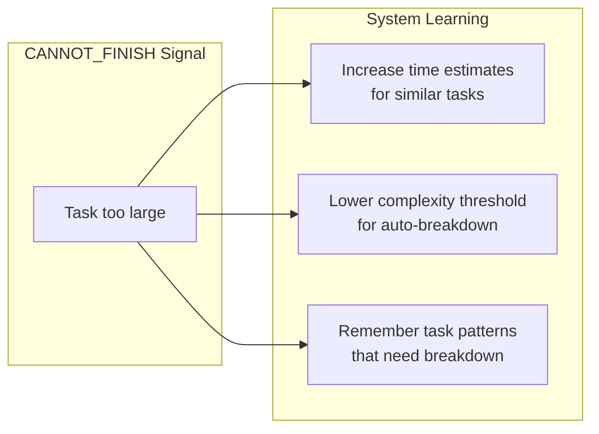

## Phase 6: Task Completion

```mermaid
flowchart TD
    Done([User: "Done!"]) --> Update[Update Notion status]
    Update --> Reward[Trigger Reward Engine]

    Reward --> Calculate[Calculate intensity score]
    Calculate --> Deliver[Deliver rewards in parallel]

    subgraph RewardDelivery["Reward Delivery"]
        Emoji[Emoji celebration]
        GIF[Animated GIF]
        Music[Play music via home audio]
        TextSO[Text significant other]
    end

    Deliver --> Emoji
    Deliver --> GIF
    Deliver --> Music
    Deliver --> TextSO

    Deliver --> Feedback{Ask for feedback?}

    Feedback -->|Optional| HowFelt["How did that feel?"]
    Feedback -->|Skip| Summary

    HowFelt --> Easier["Easier than expected"]
    HowFelt --> Right["About right"]
    HowFelt --> Harder["Harder than expected"]

    Easier --> AdjustDown[Lower time estimate]
    Right --> NoChange[Keep estimate]
    Harder --> AdjustUp[Increase time estimate]

    AdjustDown --> Summary[Session Summary]
    NoChange --> Summary
    AdjustUp --> Summary

    Summary --> Prompt{Continue?}
    Prompt -->|Yes| NextTask([Get another task])
    Prompt -->|No| Outing{High intensity?}
    Outing -->|Yes| SuggestOuting[Suggest fun outing]
    Outing -->|No| End([End session])
    SuggestOuting --> End
```

### Reward Intensity Scaling

The reward system scales celebrations based on achievement significance:

| Trigger | Intensity | Rewards Activated |
|---------|-----------|-------------------|
| Quick task (< 15 min) | Low | Emoji only |
| Standard task | Medium | Emoji + maybe GIF |
| Focus/difficult task | High | Emoji + GIF + Music + Text SO |
| Parent task complete | Epic | All rewards + AI video + Outing suggestion |
| All tasks cleared | Epic | Maximum celebration |

## Complete Task Journey Example

```mermaid
journey
    title Task: "Review Sarah's proposal"
    section Intake
      User describes task: 5: User
      AI asks about deadline: 3: AI
      User says "by Friday": 5: User
      AI confirms and labels: 4: AI
    section Waiting
      Task sits in Notion: 3: System
      2 days pass: 2: System
    section Selection
      User has 30 minutes: 5: User
      AI suggests this task: 4: AI
      User accepts: 5: User
    section Execution
      User reviews proposal: 4: User
      User marks done: 5: User
    section Celebration
      Emoji explosion displayed: 5: AI
      GIF shows Taylor Swift dancing: 5: AI
      Victory song plays on speakers: 5: System
      Partner receives celebration text: 5: System
      AI suggests coffee at favorite cafe: 4: AI
```
