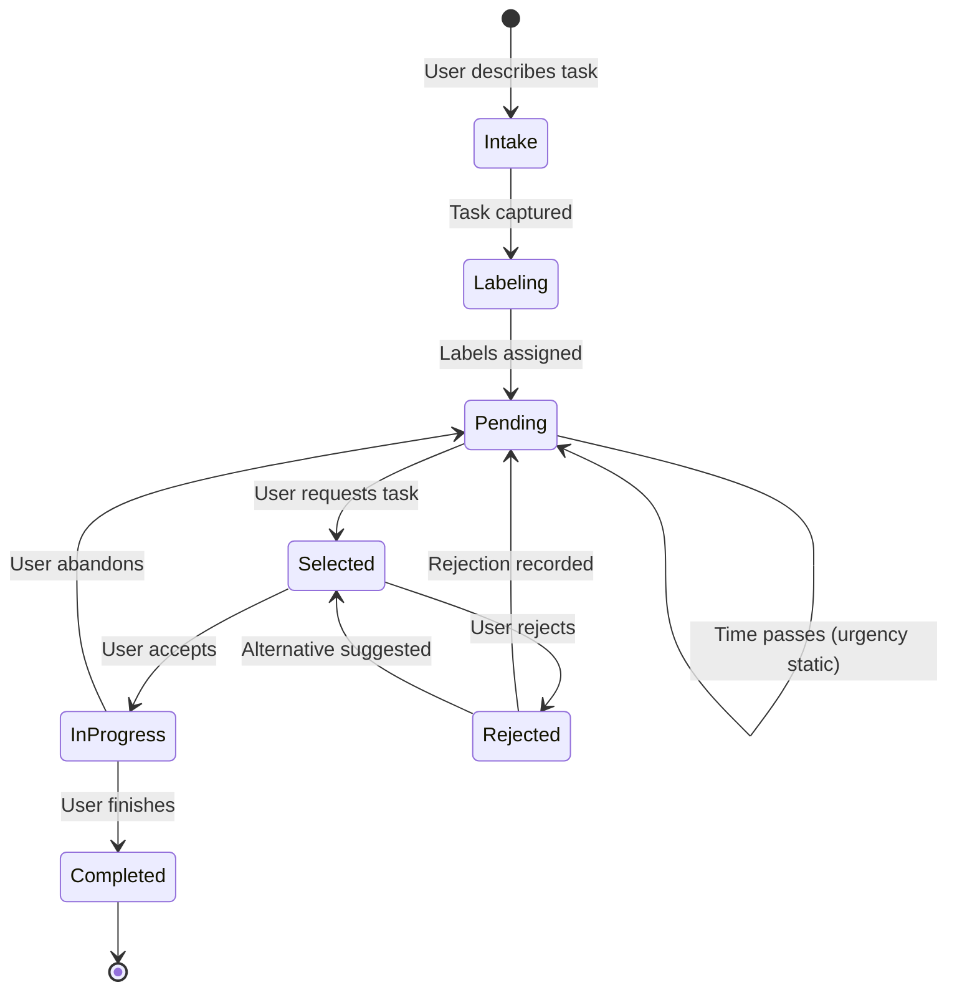
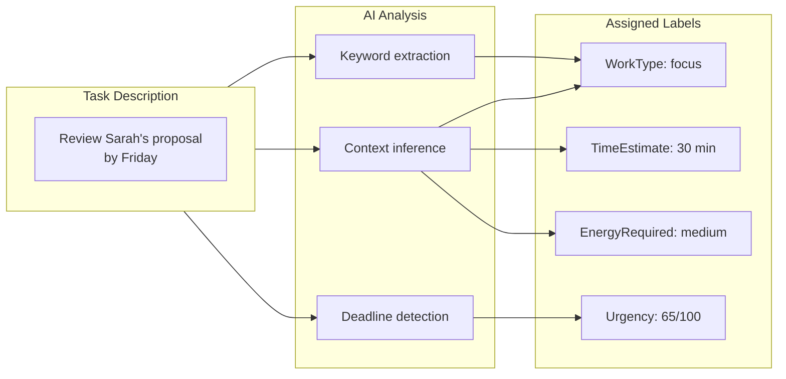
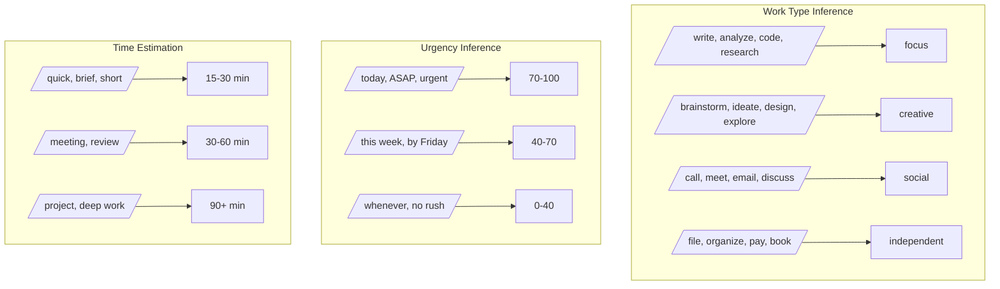
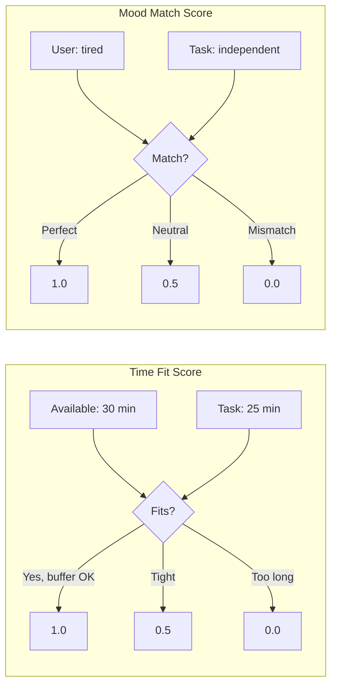
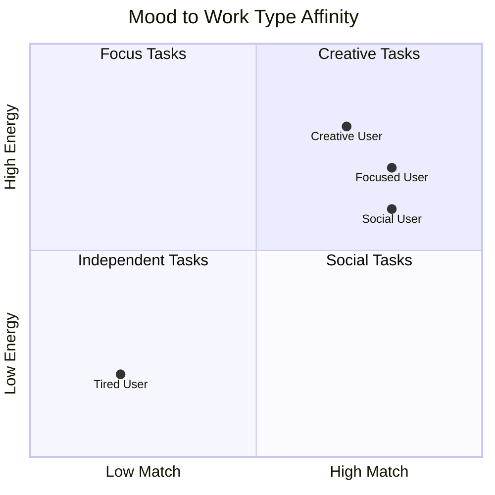
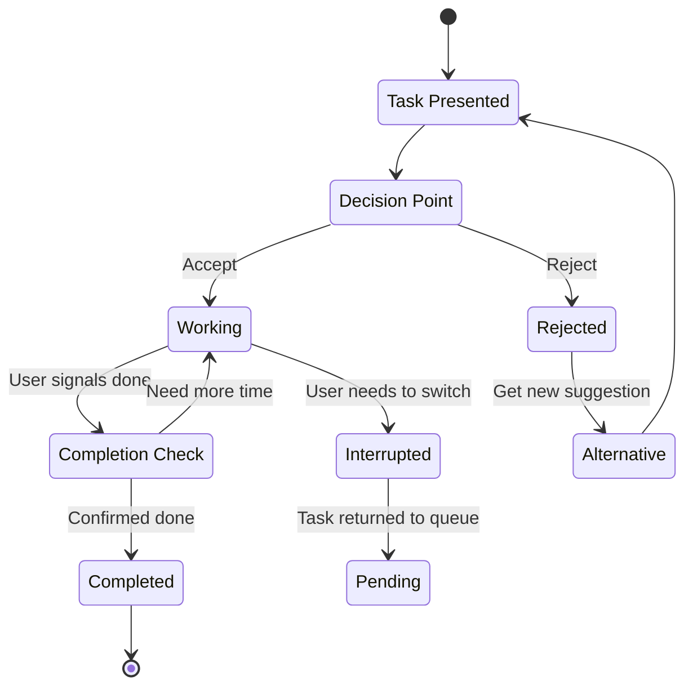
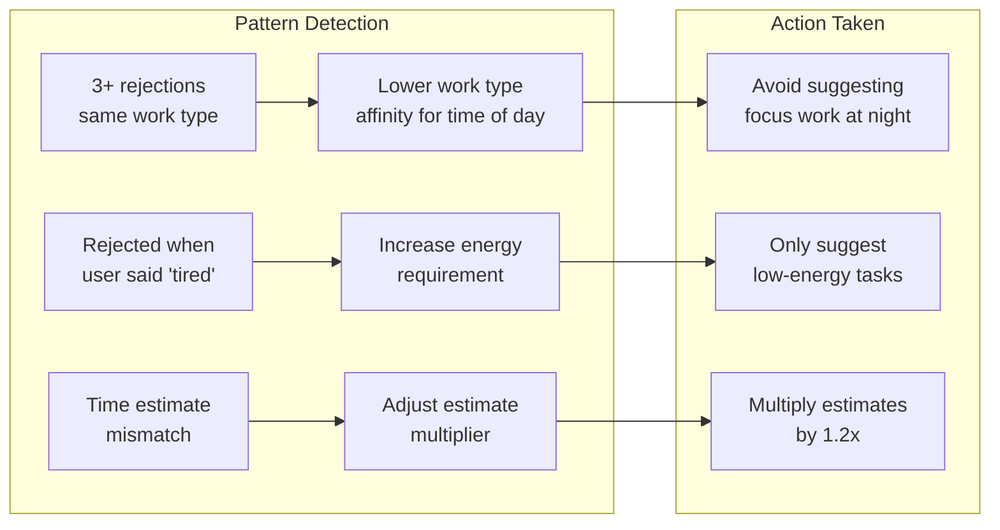
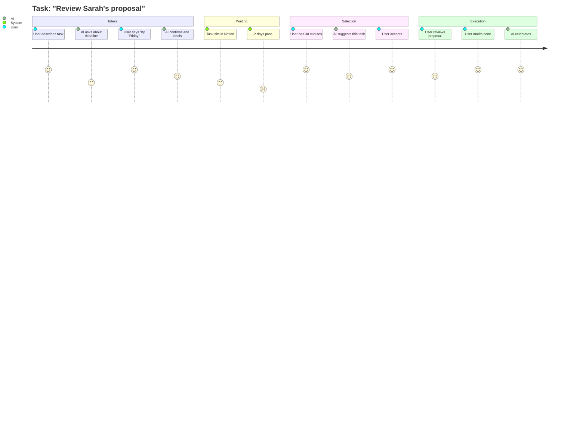

# Task Lifecycle

## Overview

A task in hide-my-list goes through several states from creation to completion. This document details each phase of that journey.

## Complete Task Lifecycle



## Task States

| State | Description | Notion Status |
|-------|-------------|---------------|
| Intake | Task being captured, AI asking questions | N/A (not yet saved) |
| Labeling | AI assigning work type, urgency, time estimate | N/A (not yet saved) |
| Pending | Task saved, waiting to be selected | `pending` |
| Selected | Task suggested to user, awaiting response | `pending` |
| In Progress | User actively working on task | `in_progress` |
| Rejected | User declined, giving feedback | `pending` |
| Completed | Task finished | `completed` |

## Phase 1: Task Intake


## Phase 2: Label Assignment



### Label Inference Rules



## Phase 3: Task Selection

```mermaid
flowchart TD
    Request([User: "I have 30 min, feeling tired"]) --> Parse[Parse time + mood]
    Parse --> Fetch[Fetch pending tasks from Notion]
    Fetch --> Score[Score each task]

    subgraph Scoring["Scoring Algorithm"]
        TimeFit[Time Fit × 0.3]
        MoodMatch[Mood Match × 0.4]
        UrgencyScore[Urgency × 0.2]
        History[History Bonus × 0.1]

        TimeFit --> Total[Total Score]
        MoodMatch --> Total
        UrgencyScore --> Total
        History --> Total
    end

    Score --> Scoring
    Total --> Select[Select highest score]
    Select --> Present([Present to user])
```

### Scoring Details



### Mood to Work Type Matching



## Phase 4: Task Execution



## Phase 5: Rejection Handling


### Rejection Learning



## Phase 6: Task Completion

```mermaid
flowchart TD
    Done([User: "Done!"]) --> Update[Update Notion status]
    Update --> Feedback{Ask for feedback?}

    Feedback -->|Optional| HowFelt["How did that feel?"]
    Feedback -->|Skip| Summary

    HowFelt --> Easier["Easier than expected"]
    HowFelt --> Right["About right"]
    HowFelt --> Harder["Harder than expected"]

    Easier --> AdjustDown[Lower time estimate]
    Right --> NoChange[Keep estimate]
    Harder --> AdjustUp[Increase time estimate]

    AdjustDown --> Summary[Session Summary]
    NoChange --> Summary
    AdjustUp --> Summary

    Summary --> Prompt{Continue?}
    Prompt -->|Yes| NextTask([Get another task])
    Prompt -->|No| Celebrate([End session])
```

## Complete Task Journey Example


