# User Interactions

## Overview

All interactions in hide-my-list happen through natural language conversation. The AI determines user intent from their message and responds appropriately. This document details all conversation flows and user journeys.

## Intent Detection


### Intent Signal Examples

| Intent | Example Messages |
|--------|------------------|
| ADD_TASK | "I need to...", "Add...", "Remind me to...", "New task:" |
| GET_TASK | "I have X minutes", "What should I do?", "I'm ready to work" |
| COMPLETE | "Done", "Finished", "Completed", "I did it" |
| REJECT | "Not that one", "Something else", "I don't want to" |
| CANNOT_FINISH | "This is too big", "I can't finish this", "Too much for one sitting" |
| NEED_HELP | "How do I start?", "What should I do first?", "I'm stuck", "Break this down" |
| CHECK_IN | System-initiated (timer triggered, not user message) |
| CHAT | "Hello", "How does this work?", "What's in my list?" |

## Flow 1: Task Intake


### Intake Conversation Tree


### Quick Capture vs. Detailed Intake

```mermaid
flowchart LR
    subgraph Quick["Quick Capture (Common)"]
        Q1[User: "Call mom"] --> Q2[AI: "Added - social, 15 min, low urgency"]
    end

    subgraph Detailed["Detailed Intake (When Needed)"]
        D1[User: "Work on the project"] --> D2[AI: "Which project?"]
        D2 --> D3[User: "The Q4 marketing plan"]
        D3 --> D4[AI: "Got it. Is this creative work or more analytical?"]
        D4 --> D5[User: "Creative, brainstorming phase"]
        D5 --> D6[AI: "Added - creative work, 90 min estimate"]
    end
```

## Flow 2: Task Selection


### Selection Decision Tree


### Mood Interpretation


## Flow 3: Task Completion

```mermaid
sequenceDiagram
    participant U as User
    participant AI as AI Assistant
    participant R as Reward Engine
    participant N as Notion
    participant HA as Home Audio
    participant SMS as SMS Service

    U->>AI: "Done!"

    AI->>N: Update task status → completed
    AI->>N: Set completedAt timestamp
    N-->>AI: Success

    AI->>R: Trigger reward evaluation
    R->>R: Calculate intensity score

    par Parallel Reward Delivery
        R->>AI: Emoji celebration + GIF
        R->>HA: Play victory music
        R->>SMS: Text significant other
    end

    AI->>U: "CRUSHED IT! 🔥💪✨ [GIF: Taylor Swift party]"

    Note over HA: "We Are The Champions" plays

    alt High intensity achievement
        R->>AI: Generate outing suggestion
        AI->>U: "You've earned it! Coffee at Luna Cafe? ☕"
    end

    alt User provides feedback
        U->>AI: "Easier than expected"
        Note over AI: Reduce time estimate for similar tasks
        AI->>U: "Good to know - I'll remember that. Ready for another?"
    else User skips
        U->>AI: "Next task"
        AI->>U: "What's your energy like now?"
    end
```



### Reward Delivery System

The completion flow triggers a multi-channel reward system designed to maximize dopamine delivery:

```mermaid
flowchart TD
    Done([User: "Done!"]) --> Evaluate[Evaluate Achievement]

    Evaluate --> Score[Calculate Intensity Score]
    Score --> Level{Intensity Level}

    Level -->|Low| LowReward[Emoji only<br/>"Nice! ✨"]
    Level -->|Medium| MedReward[Emoji + GIF<br/>"Crushing it! 🎉💪"]
    Level -->|High| HighReward[Emoji + GIF + Music + Text SO]
    Level -->|Epic| EpicReward[All rewards + AI Video + Outing]

    subgraph SystemRewards["System-Generated Rewards"]
        Emoji[Emoji Explosion]
        GIF[Animated GIF<br/>Taylor Swift, celebrations]
        Video[AI Video via Sora]
        Music[Home Audio Playback<br/>Sonos/HomePod/Echo]
    end

    subgraph InterpersonalRewards["Interpersonal Rewards"]
        TextSO[Text Significant Other<br/>"Your partner crushed a big task!"]
        Outing[Suggest Fun Outing<br/>"Coffee at your favorite spot?"]
    end

    HighReward --> SystemRewards
    HighReward --> InterpersonalRewards
    EpicReward --> SystemRewards
    EpicReward --> InterpersonalRewards
```

### Intensity Scoring

| Factor | Weight | Examples |
|--------|--------|----------|
| Task difficulty | 30% | Time estimate, energy required |
| Current streak | 25% | 3+ tasks = bonus |
| Task type | 20% | Parent complete = major bonus |
| Time of day | 15% | End of day = bonus |
| Recent history | 10% | Diminishing returns if many recent rewards |

### Completion Feedback Loop

```mermaid
flowchart TD
    Done([User: "Done!"]) --> Update[Update Notion]
    Update --> Reward[Trigger Reward Engine]

    Reward --> SessionCheck{First completion today?}

    SessionCheck -->|Yes| Celebrate["FIRST ONE DOWN! 🎯✨"]
    SessionCheck -->|No| Streak["That's 3 done today! 🔥💪🎉"]

    Celebrate --> DeliverRewards
    Streak --> DeliverRewards

    DeliverRewards[Deliver Multi-Channel Rewards] --> Feedback

    Feedback{Ask for feedback?}
    Feedback -->|Sometimes| Ask["How did that feel?"]
    Feedback -->|Often| Skip[Skip to next prompt]

    Ask --> Easier[Easier than expected]
    Ask --> Right[About right]
    Ask --> Harder[Harder than expected]
    Ask --> NoAnswer[User ignores]

    Easier --> LearnEasy[Reduce time estimates]
    Right --> NoChange[Keep estimates]
    Harder --> LearnHard[Increase estimates]
    NoAnswer --> Continue

    LearnEasy --> Continue
    NoChange --> Continue
    LearnHard --> Continue

    Skip --> Continue{Continue working?}
    Continue -->|Yes| NextTask[Get another task]
    Continue -->|No| OutingCheck{High intensity?}
    OutingCheck -->|Yes| SuggestOuting["You've earned a break!<br/>How about [favorite_activity]?"]
    OutingCheck -->|No| End([End session])
    SuggestOuting --> End
```

## Flow 4: Task Rejection


### Rejection Reason Categories


### Rejection Escalation


## Flow 5: Cannot Finish (Task Breakdown)

When a user indicates they cannot finish a task, it signals the task was too large and needs to be broken down into smaller sub-tasks. **Critically, the AI must first ask what the user accomplished** to understand what remains.


### Cannot Finish Decision Tree

```mermaid
flowchart TD
    CannotFinish([User: "This is too big"]) --> AskProgress["Ask: What did you accomplish?"]
    AskProgress --> UserDescribes[User describes progress]
    UserDescribes --> Analyze[Analyze remaining work]
    Analyze --> HasSubtasks{Already has sub-tasks?}

    HasSubtasks -->|Yes| UpdateProgress[Update completed sub-tasks]
    HasSubtasks -->|No| CreateSubtasks[Break remainder into sub-tasks]

    UpdateProgress --> RemainingTooLarge{Remaining sub-task too large?}
    RemainingTooLarge -->|Yes| BreakFurther[Break into smaller chunks]
    RemainingTooLarge -->|No| OfferNext[Offer next sub-task]

    CreateSubtasks --> InferBreakdown[AI infers logical breakdown<br/>based on what remains]
    InferBreakdown --> SaveHidden[Save sub-tasks to Notion<br/>Hidden from user]

    BreakFurther --> SaveHidden
    SaveHidden --> OfferFirst[Offer first remaining sub-task]

    OfferNext --> Present([Present manageable task])
    OfferFirst --> Present
```

### Breakdown Strategy


**Key Principles:**
- Sub-task breakdown is NEVER shown to the user as a full list
- Each sub-task should be completable in one sitting (typically 15-90 min)
- The AI presents only the current actionable sub-task
- Parent task only completes when all sub-tasks are done

### Cannot Finish Response Templates

| Scenario | Response Template |
|----------|-------------------|
| First time | "Got it - that's a big one. I've broken it into smaller pieces. Ready for the first chunk?" |
| Already broken | "Still too much? Let me find an even smaller piece to start with." |
| Can't break further | "This is pretty atomic. What specific part is blocking you?" |
| Making progress | "Nice - one piece done. Ready for the next bit?" |

---

## Flow 6: Breakdown Assistance (On-Demand Help)

A core principle of hide-my-list: **users interpret vague goals as infinite, and thus avoid them.** The agent must always be ready to help users understand exactly what to do next. This flow handles when users need help starting or continuing a task.


### Breakdown Assistance Decision Tree


### Proactive Assistance Triggers

The agent should proactively offer breakdown assistance when it detects:

| Signal | Agent Response |
|--------|----------------|
| Long pause after accepting task | "Need help getting started? I can break this down further." |
| "Hmm" / "Uh" / hesitation words | "Want me to walk you through the steps?" |
| "I guess" / uncertain acceptance | "Let me give you a clear starting point..." |
| User returns without completing | "Picking this back up? Here's where you left off and what's next." |

### Assistance Response Levels


The agent adjusts detail level based on user signals:
- Confident user → Level 1-2
- Uncertain user → Level 2-3
- Stuck user → Level 3-4
- Very stuck user → Level 4 with encouragement

### Assistance Conversation Examples

**User needs starting help:**
```
User: "Sure, I'll do the proposal"
AI: "Perfect! Let's make this concrete:
     1. Open Google Docs and create a new file
     2. Title it 'Project Proposal - [Date]'
     3. Write one sentence: What problem are you solving?

     Just do step 1 right now. Ready when you are!"
```

**User stuck mid-task:**
```
User: "I'm stuck on this"
AI: "No problem - where did you get to? Tell me the last thing you finished and I'll point you to the exact next action."
```

**User wants the full picture:**
```
User: "What are all the steps?"
AI: "Here's the full breakdown:
     1. Problem statement (5 min) ← you are here
     2. Solution options (10 min)
     3. Timeline (5 min)
     4. Quick review (5 min)

     Total: ~25 min. Want to start with the problem statement?"
```

---

## Flow 7: Check-In Follow-Up

When a user accepts a task, the system sets a timer for 1.25x the estimated completion time. If the timer expires before the user marks the task complete, the system proactively follows up.

```mermaid
sequenceDiagram
    participant U as User
    participant UI as Chat UI
    participant T as Timer
    participant AI as AI Assistant
    participant N as Notion

    U->>AI: "Sure, I'll do that"
    AI->>N: Update status → in_progress
    AI->>U: "Great, it's yours. Let me know when done!"
    AI->>UI: Return time_estimate (30 min)
    UI->>T: Set timer for 37.5 min

    Note over T: 37.5 minutes later...

    T->>UI: Timer expired
    UI->>AI: CHECK_IN request
    AI->>N: Verify task still in_progress
    N-->>AI: Yes, still in_progress
    AI->>U: "How's the quarterly report going? Still at it?"

    alt User completed
        U->>AI: "Oh yeah, finished that!"
        AI->>N: Update status → completed
        AI->>U: "Nice! Marking that off."
        UI->>T: Clear timer
    else User still working
        U->>AI: "Still working on it"
        AI->>U: "No rush - keep at it!"
        UI->>T: Reset timer (15 min)
    else User got distracted
        U->>AI: "Ugh, got distracted"
        AI->>U: "Happens to everyone. Want to jump back in?"
    else User needs more time
        U->>AI: "Need another 20 minutes"
        AI->>U: "No problem, I'll check back then."
        UI->>T: Set timer (25 min)
    else User wants to stop
        U->>AI: "Let me do something else"
        AI->>N: Update status → pending
        AI->>U: "Got it - back in the queue. What next?"
        UI->>T: Clear timer
    end
```



### Check-In Decision Tree

```mermaid
flowchart TD
    Timer([Timer expires]) --> StillActive{Task still in_progress?}

    StillActive -->|No| Skip[Skip - already handled]
    StillActive -->|Yes| CheckInCount{Check-in count?}

    CheckInCount -->|1st| Friendly["How's [task] going?"]
    CheckInCount -->|2nd| Brief["Still working on [task]?"]
    CheckInCount -->|3rd| Gentle["Want to take a break from [task]?"]
    CheckInCount -->|4th+| Stop[Stop checking in]

    Friendly --> UserResponse
    Brief --> UserResponse
    Gentle --> UserResponse

    UserResponse{User response}
    UserResponse --> Done["Done!"]
    UserResponse --> Working["Still working"]
    UserResponse --> Distracted["Got distracted"]
    UserResponse --> MoreTime["Need more time"]
    UserResponse --> Stop2["Want to stop"]

    Done --> Complete[Mark completed, clear timer]
    Working --> Reset1[Reset timer 0.5x]
    Distracted --> Nudge["Jump back in?"]
    MoreTime --> AskDuration["How much longer?"]
    Stop2 --> ReturnQueue[Return to pending]

    Nudge --> YesNo{User choice}
    YesNo -->|Yes| Reset2[Reset timer 0.5x]
    YesNo -->|No| ReturnQueue

    AskDuration --> NewTime[User provides time]
    NewTime --> Reset3[Set timer to time × 1.25]
```

### Check-In Response Templates

| Scenario | AI Response |
|----------|-------------|
| 1st check-in | "How's [task] going? Still at it?" |
| 2nd check-in | "Still working on [task]?" |
| 3rd check-in | "Want to take a break from [task]? I'll be here when you're ready." |
| User says done | "Nice! Marking that off. Ready for another?" |
| User still working | "No rush - keep at it! I'll check back in a bit." |
| User got distracted | "Happens to everyone. Want to jump back in, or try something else?" |
| User needs more time | "No problem. About how much longer do you think?" |
| User wants to stop | "Got it - I'll put that back in the queue. What would you like to do instead?" |

### Client-Side Timer Implementation

The check-in mechanism uses client-side timers to work with the stateless HTTP architecture:

```mermaid
flowchart LR
    subgraph Client["Frontend (app.js)"]
        Accept[Task accepted] --> Store[Store active task]
        Store --> SetTimer[Set setTimeout]
        SetTimer --> Timer[Timer running]
        Timer --> Fire[Timer fires]
        Fire --> Send[Send CHECK_IN]
    end

    subgraph Cleanup["Timer Cleanup"]
        Complete[User completes] --> Clear1[clearTimeout]
        Abandon[User abandons] --> Clear2[clearTimeout]
        NewTask[New task accepted] --> Clear3[clearTimeout]
    end
```

**Stored State:**
- `activeTaskId`: Current task ID
- `activeTaskTitle`: Task name for display
- `checkInTimer`: setTimeout reference
- `checkInCount`: Number of check-ins for this session

---

## Flow 8: Special Cases

### Empty Queue

```mermaid
flowchart TD
    Request([User: "What should I do?"]) --> Check[Check Notion]
    Check --> Empty{Any pending tasks?}

    Empty -->|Yes| Normal[Normal selection flow]
    Empty -->|No| Celebrate["Your slate is clear!"]

    Celebrate --> Prompt["Nothing's waiting for you.<br/>Enjoy it, or add something new?"]

    Prompt --> Add["Add a task"]
    Prompt --> Leave["Take a break"]
```

### No Good Match

```mermaid
flowchart TD
    Request([User: "15 min, feeling focused"]) --> Check[Check tasks]
    Check --> NoMatch{Any tasks match?}

    NoMatch -->|All too long| TimeIssue["Nothing fits 15 minutes.<br/>Your shortest task is 30 min."]
    NoMatch -->|Wrong mood| MoodIssue["No focus tasks available.<br/>Want to try something else?"]
    NoMatch -->|Both| BothIssue["Tough to find a match right now."]

    TimeIssue --> Options1["Got more time?<br/>Or add a quick task?"]
    MoodIssue --> Options2["How about [other type]<br/>Or change your mood?"]
    BothIssue --> Options3["Want to add something<br/>or come back later?"]
```

### User Asks About Their List

```mermaid
flowchart TD
    Ask([User: "What's in my list?"]) --> Philosophy[Explain philosophy]

    Philosophy --> Response["I keep track so you don't have to!<br/>You've got 8 tasks waiting.<br/>Ready to knock one out?"]

    Response --> Follow{User follows up?}
    Follow -->|Insists| Gentle["The point is not having to look.<br/>Trust me - I'll surface the right one."]
    Follow -->|Accepts| Selection[Normal selection flow]
```

## Conversation Tone Guidelines

```mermaid
mindmap
  root((Tone))
    Casual
      "Got it"
      "Nice work"
      "No problem"
    Brief
      One question at a time
      Short confirmations
      Minimal small talk
    Collaborative
      "Help me learn"
      "What's steering you away?"
      Never apologize excessively
    Confident
      Present suggestions directly
      Trust the algorithm
      Don't second-guess
```

## Example Full Session

```mermaid
sequenceDiagram
    participant U as User
    participant AI as AI
    participant HA as Home Audio
    participant SMS as SMS

    U->>AI: Hey
    AI->>U: Hey! Ready to add a task or work on something?

    U->>AI: I need to email the team about the offsite
    AI->>U: Got it - is there a deadline for this?
    U->>AI: Should go out today
    AI->>U: Added - social task, ~15 min, high urgency. What else?

    U->>AI: Also need to book travel for the offsite
    AI->>U: Added - independent task, ~30 min. Ready to work or keep adding?

    U->>AI: I've got 20 minutes before a meeting
    AI->>U: Perfect - how about sending that team email? It's short and urgent.
    U->>AI: Yeah let's do it
    AI->>U: Great, it's yours. Let me know when you're done!

    Note over U,AI: 12 minutes later

    U->>AI: Done

    par Celebration
        AI->>U: FIRST ONE DOWN! 🎯✨💪 [GIF: office high five]
        HA->>HA: Plays victory jingle (15 sec)
        SMS->>SMS: "[Partner], your person just knocked out their first task! 🙌"
    end

    AI->>U: Got time for another quick one?
    U->>AI: No, meeting's starting
    AI->>U: No worries - you're off to a great start! ✨
```

## Example Session with Check-In

```mermaid
sequenceDiagram
    participant U as User
    participant AI as AI
    participant T as Timer

    U->>AI: I have an hour, feeling focused
    AI->>U: How about working on the quarterly report? ~45 min of focus work.
    U->>AI: Sure
    AI->>U: Great, it's yours. Let me know when done!
    AI->>T: Set timer: 56 min (45 × 1.25)

    Note over U,T: 56 minutes later...

    T->>AI: Timer expired
    AI->>U: How's the quarterly report going? Still at it?

    U->>AI: Ugh, I got distracted reading emails
    AI->>U: Happens to everyone. Want to jump back in, or try something else?

    U->>AI: Yeah let me finish it
    AI->>U: You got this! I'll check back in a bit.
    AI->>T: Reset timer: 22 min (45 × 0.5)

    Note over U,T: 22 minutes later...

    T->>AI: Timer expired
    AI->>U: Still working on the report?

    U->>AI: Just finished!
    AI->>U: Nice work! That's a big one done. Ready for a break or another task?
    T->>T: Timer cleared
```
