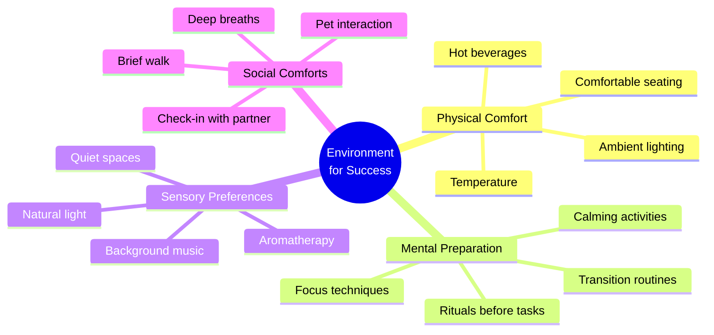
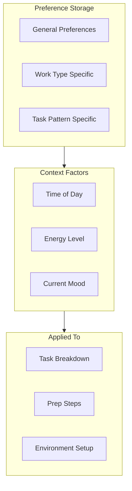
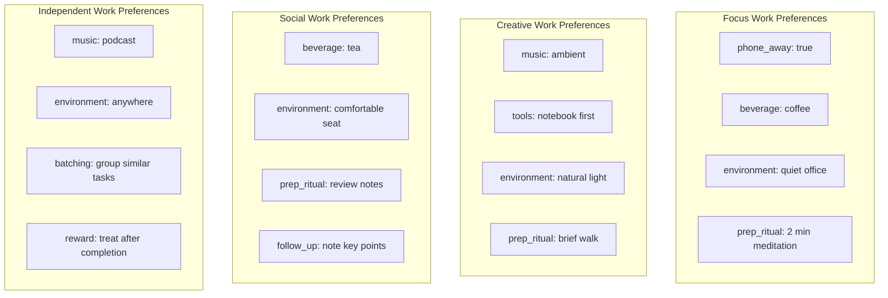
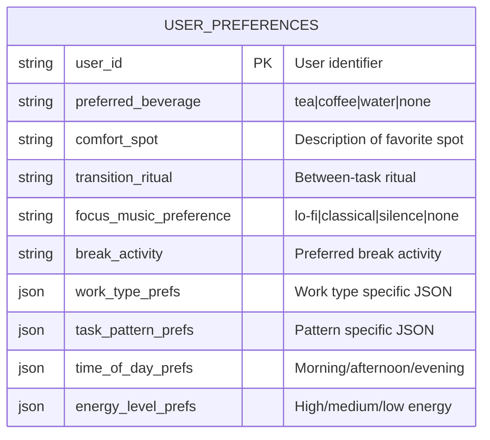
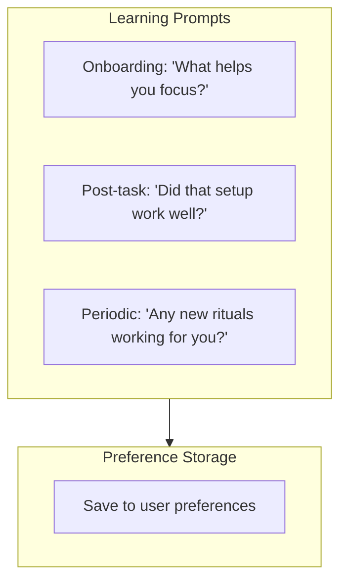
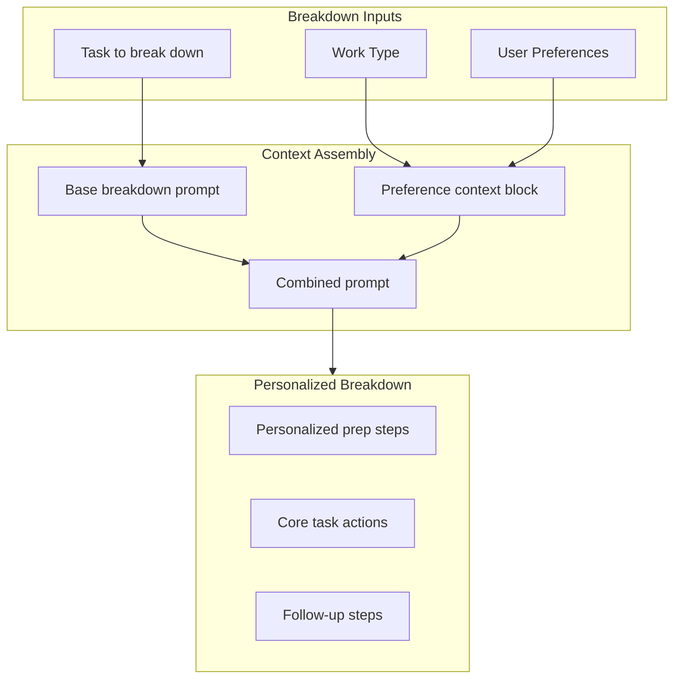
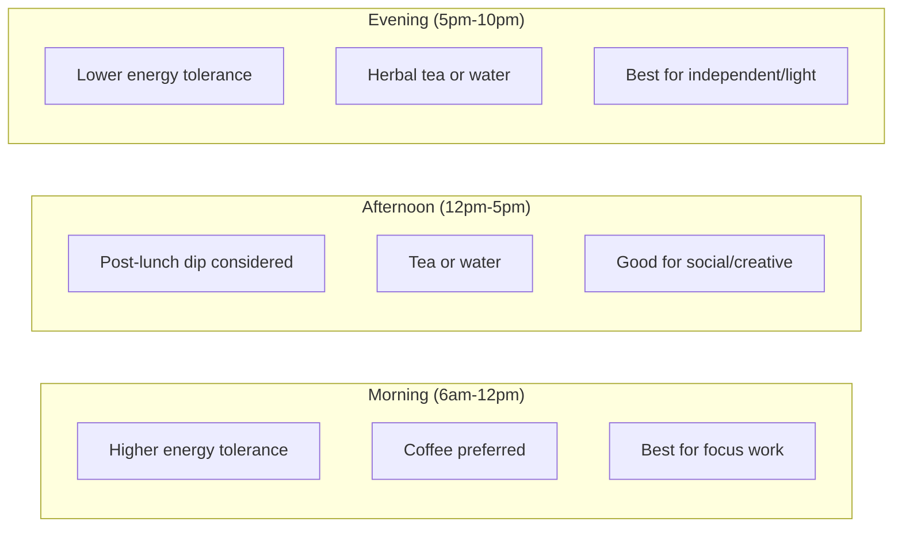
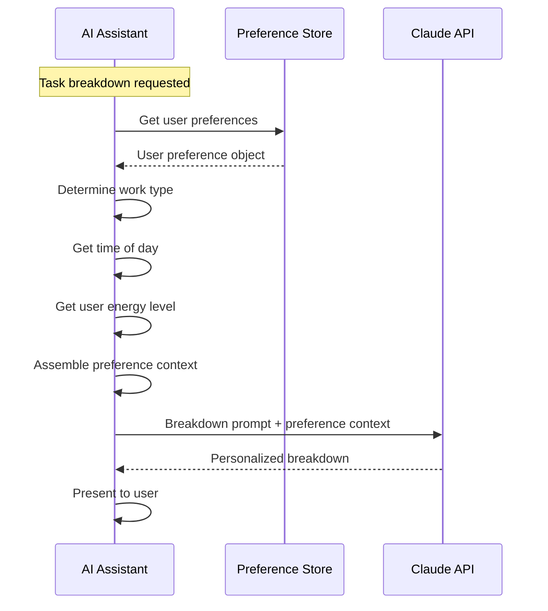
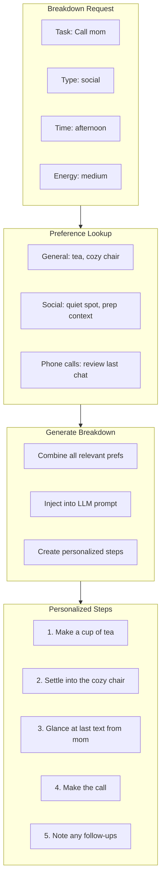

# User Preferences & Comfort System

## Overview

The user preferences system tracks individual user comforts, rituals, and preferences that help create an environment for success when approaching different types of tasks. Rather than generic task breakdowns, the system generates personalized steps that acknowledge what helps each user perform their best.

## Core Philosophy



**Key Insight:** Users are more likely to start (and complete) tasks when the environment feels supportive. A personalized "prep step" like "Make a cup of tea" can reduce the activation energy needed to begin.

---

## Preference Architecture



---

## Preference Categories

### 1. General Preferences

Universal comforts that apply across all task types.

| Preference | Example Values | Usage |
|------------|----------------|-------|
| preferred_beverage | tea, coffee, water, none | Suggested before longer tasks |
| comfort_spot | cozy chair, standing desk, patio | Suggested for focus/social tasks |
| transition_ritual | stretch, deep breaths, brief walk | Suggested between tasks |
| focus_music | lo-fi, classical, silence | Suggested during focus work |
| break_activity | walk, snack, pet time | Suggested after completions |

### 2. Work Type Preferences

Specific preferences tied to the four work types.



### 3. Task Pattern Preferences

Preferences for specific recurring task patterns.

| Pattern | Preference | Example |
|---------|------------|---------|
| phone_calls | pre_call_ritual | "Review contact notes, prepare talking points" |
| phone_calls | environment | "Quiet room, pacing allowed" |
| writing | warmup | "Free-write for 2 min first" |
| email_batch | setup | "Close other tabs, set timer" |
| meetings | prep | "Review agenda, prepare 1 question" |
| exercise | motivation | "Put on workout playlist" |

---

## Preference Schema

### User Preferences Table (Notion or Config)



### Work Type Preferences JSON Structure

```json
{
  "focus": {
    "beverage": "coffee",
    "environment": "quiet office with door closed",
    "prep_steps": ["put phone in another room", "close email tabs"],
    "music": "lo-fi beats",
    "ideal_duration": "45-90 min blocks"
  },
  "creative": {
    "beverage": "tea",
    "environment": "natural light, open space",
    "prep_steps": ["take a brief walk", "grab notebook"],
    "music": "ambient or silence",
    "tools": "start with paper before digital"
  },
  "social": {
    "beverage": "tea",
    "environment": "comfortable, quiet spot",
    "prep_steps": ["review context/notes", "set intention"],
    "follow_up": "note key takeaways after"
  },
  "independent": {
    "beverage": "water",
    "environment": "anywhere comfortable",
    "batching": true,
    "music": "podcast or music",
    "reward": "small treat after batch complete"
  }
}
```

### Task Pattern Preferences JSON Structure

```json
{
  "phone_calls": {
    "prep_steps": ["find quiet room", "review last interaction", "prepare 2-3 topics"],
    "environment": "comfortable seat, room to pace",
    "beverage": "tea",
    "follow_up": "send follow-up text/email if needed"
  },
  "writing": {
    "warmup": "2 min free-write",
    "environment": "quiet, minimal distractions",
    "tools": "outline first, then draft",
    "breaks": "every 25 min"
  },
  "email_batch": {
    "setup": ["close other tabs", "set 20 min timer"],
    "approach": "quick responses first, then complex",
    "environment": "desk, focused"
  }
}
```

---

## Preference Learning

The system learns preferences through explicit input and implicit observation.

### Explicit Learning



**Onboarding Questions:**

| Question | Maps To |
|----------|---------|
| "Do you have a favorite drink while working?" | preferred_beverage |
| "Where do you do your best thinking?" | comfort_spot |
| "What helps you transition between tasks?" | transition_ritual |
| "Music or silence while working?" | focus_music_preference |

### Implicit Learning

```mermaid
flowchart LR
    subgraph Signals["Observed Signals"]
        S1["Task completed quickly after tea mention"]
        S2["Focus tasks always at standing desk"]
        S3["Social tasks completed faster in morning"]
    end

    subgraph Learning["Pattern Detection"]
        L1[Associate beverage with task success]
        L2[Link location to work type]
        L3[Map time-of-day to performance]
    end

    subgraph Apply["Applied Preferences"]
        A1[Suggest tea before similar tasks]
        A2[Recommend standing desk for focus]
        A3[Schedule social tasks AM when possible]
    end

    Signals --> Learning --> Apply
```



---

## Preference Injection

### Task Breakdown Enhancement

When generating task breakdowns, user preferences are injected as context for the LLM.



### Context Block Format

The preference context is added to LLM prompts when generating breakdowns:

```
USER CONTEXT:
This user has the following preferences for {work_type} tasks:
- Environment: {environment_preference}
- Beverage: {beverage_preference}
- Prep ritual: {prep_ritual}
- Additional notes: {any_relevant_patterns}

When generating sub-tasks, include personalized prep steps that align with these preferences.
The first 1-2 steps should focus on environment setup and mental preparation.
```

### Example: Generic vs. Personalized Breakdown

**Generic breakdown for "Call mom":**
```
1. Find quiet spot
2. Make call
3. Note follow-ups
```

**Personalized breakdown for user who drinks tea and likes comfortable spots:**
```
1. Make a cup of tea
2. Settle into the cozy chair in the living room
3. Make the call
4. Note any follow-ups or commitments
```

---

## Time & Energy Context

Preferences can vary by time of day and energy level.

### Time-of-Day Preferences



### Energy-Based Adjustments

| Energy Level | Prep Step Adjustments |
|--------------|----------------------|
| High | Minimal prep, dive in quickly |
| Medium | Standard prep rituals |
| Low | Extended prep, comfort-focused, smaller first steps |

---

## Implementation Flow

### Preference Retrieval



### Breakdown Generation with Preferences



---

## User Experience

### Learning Preferences Naturally

The system learns preferences through natural conversation:

```
User: "I need to call the dentist"
AI: "Added - social, ~10 min. Quick question: what helps you gear up for phone calls? Some folks like a drink, others a quiet spot."
User: "I usually make tea first"
AI: "Good to know! I'll remember that. ☕"
```

### Applying Preferences

```
User: "Ready for a task"
AI: "How about calling your dentist? Here's the plan:
     1. Put the kettle on for tea
     2. Find a quiet spot - maybe the living room?
     3. Make the call
     4. Note any appointment times

     Start with step 1 when you're ready!"
```

### Confirming Preference Relevance

```
User: "Done with the call!"
AI: "Nice work! Did having tea help, or should I skip that next time?"
User: "Definitely helps"
AI: "Noted - tea before calls it is! 🍵"
```

---

## Privacy & Control

### User Control

| Control | Description |
|---------|-------------|
| View preferences | User can see all stored preferences |
| Edit preferences | User can modify any preference |
| Delete preferences | User can clear all learned preferences |
| Pause learning | User can disable implicit learning |
| Opt-out of prep steps | User can request "just the task" |

### Data Minimization

- Preferences stored only for personalization
- No sensitive personal data in preferences
- Preferences never shared externally
- Learning limited to task-relevant patterns

---

## Future Enhancements

### Environmental Integration

- Connect to smart home for automatic environment setup
- Dim lights for focus work
- Play preferred music automatically
- Adjust thermostat based on task type

### Partner Preferences

- Learn what helps when working alongside partner
- Coordinate quiet hours
- Shared rituals for joint tasks

### Seasonal Adjustments

- Adjust beverage preferences by season
- Outdoor suggestions in good weather
- Cozy indoor alternatives in winter
